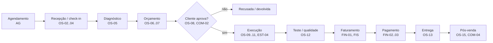
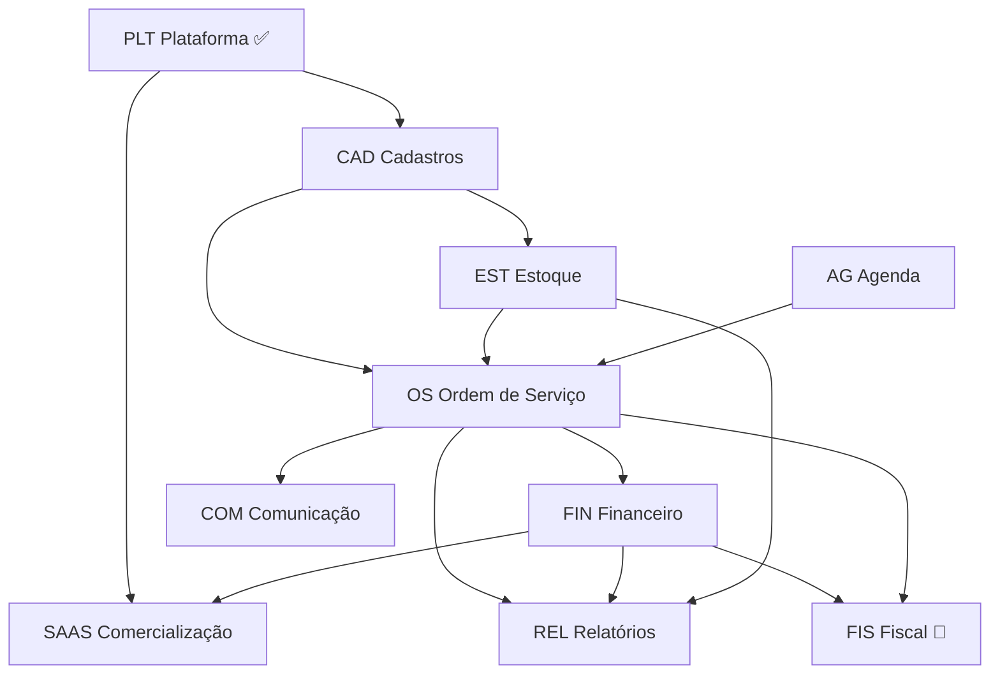

# MobiOS — Mapa de entregáveis

Tudo o que o produto deve entregar, por módulo, com as dependências entre eles.
Objetivo: **decidir o escopo completo antes de evoluir a arquitetura**. Este documento é a fonte para priorizar; a arquitetura (`ARQUITETURA.md`) segue o que for decidido aqui.

> **Como usar:** cada entregável tem um código (ex.: `OS-05`). Para priorizar, cortar ou mudar algo, cite o código.
> A coluna **Proposta** é a sugestão inicial e ainda precisa ser validada pelo dono do produto.

**Legenda:** ✅ pronto · 🟢 MVP (primeira versão vendável) · 🟡 v1.x (logo depois do MVP) · 🔵 `ee/` (módulo comercial pago) · ⚪ futuro/ideia

---

## 1. Quem usa o sistema

| Perfil | Papel no sistema | O que precisa no dia a dia |
|---|---|---|
| **Dono / gestor** | `admin` | Visão do faturamento, O.S. atrasadas, produtividade, margem; configura o sistema e a equipe |
| **Atendente / consultor técnico** | `atendente` | Receber o carro, abrir a O.S., montar o orçamento, falar com o cliente, entregar o veículo |
| **Mecânico** | `mecanico` | Ver as O.S. atribuídas a ele, registrar diagnóstico, serviços feitos e peças usadas (de preferência em tablet ou celular) |
| **Financeiro** | `financeiro` | Receber pagamentos, contas a pagar e receber, fechamento do caixa, comissões |
| **Cliente final** | *sem login* | Aprovar orçamento, ser avisado quando o carro ficar pronto, receber o comprovante |
| **Operador do SaaS** (você) | *super-admin* ⚪ | Cadastrar oficinas, planos, cobrança, suporte |

## 2. Jornada do veículo na oficina

É a espinha dorsal do produto. Cada etapa aponta os entregáveis envolvidos.

---

## 3. Módulos e entregáveis

### PLT — Plataforma (base técnica)

| Código | Entregável | Proposta |
|---|---|---|
| PLT-01 | Multi-oficina com isolamento no banco (RLS) | ✅ |
| PLT-02 | Login, sessão, papéis e permissões por função | ✅ |
| PLT-03 | Admin inicial na instalação; gestão de usuários (sem exclusão, só desativação) | ✅ |
| PLT-04 | Style guide configurável (cores, botões), logo e login com a marca da oficina | ✅ |
| PLT-05 | Página inicial com atalhos, indicadores e alertas | ✅ (indicadores de O.S./financeiro chegam com esses módulos) |
| PLT-06 | Tudo em Docker (db, migrate, api, web) | ✅ |
| PLT-07 | **Alterar a própria senha** | 🟢 |
| PLT-08 | **Limite de tentativas de login** (proteção contra força bruta) | 🟢 |
| PLT-09 | Recuperar senha por e-mail (exige servidor de e-mail/SMTP) | 🟡 |
| PLT-10 | Trilha de auditoria geral (quem alterou o quê e quando) | 🟡 |
| PLT-11 | Dados da oficina: razão social, CNPJ, endereço, telefone, IE/IM (usados na impressão da O.S. e na nota fiscal) | 🟢 |
| PLT-12 | Backup automático diário e restauração testada | 🟢 (antes do primeiro cliente real) |
| PLT-13 | Permissões finas por ação (ex.: "atendente pode dar desconto até X%") | 🟡 |
| PLT-14 | Autenticação em dois fatores (2FA) | ⚪ |

### CAD — Cadastros

| Código | Entregável | Proposta |
|---|---|---|
| CAD-01 | Clientes PF/PJ com validação de CPF/CNPJ | ✅ |
| CAD-02 | Endereço do cliente, com preenchimento automático pelo CEP | 🟢 |
| CAD-03 | Vários contatos por cliente (ex.: frota de empresa: quem aprova, quem busca o carro) | 🟡 |
| CAD-04 | Veículos com placa antiga/Mercosul, km, chassi | ✅ |
| CAD-05 | Marca e modelo por lista padronizada (tabela FIPE) em vez de texto livre | 🟡 |
| CAD-06 | Histórico do veículo: todas as O.S., km a cada visita, peças trocadas | 🟢 (chega com OS) |
| CAD-07 | **Catálogo de serviços** (mão de obra): descrição, tempo padrão, preço | 🟢 |
| CAD-08 | **Catálogo de peças/produtos** (ver EST) | 🟢 |
| CAD-09 | Fornecedores | 🟢 |
| CAD-10 | Mecânicos: especialidade e % de comissão | 🟢 |
| CAD-11 | Formas de pagamento e taxas (ex.: crédito 3,5%, prazo de recebimento) | 🟢 |
| CAD-12 | Transferir veículo de um cliente para outro (venda do carro) | 🟡 |
| CAD-13 | Importar clientes e veículos de planilha (migração de outro sistema) | 🟡 |

### OS — Ordem de Serviço (núcleo do produto)

| Código | Entregável | Proposta |
|---|---|---|
| OS-01 | Numeração sequencial por oficina, sem buracos | 🟢 |
| OS-02 | Abertura rápida: cliente + veículo + km de entrada + relato do cliente | 🟢 |
| OS-03 | **Checklist de entrada**: itens (estepe, macaco, som…), nível de combustível, avarias | 🟢 |
| OS-04 | **Fotos do veículo** na entrada (avarias) e durante o serviço | 🟢 |
| OS-05 | Diagnóstico técnico do mecânico | 🟢 |
| OS-06 | Itens da O.S.: serviços (do catálogo ou avulsos) e peças (do estoque ou avulsas), com quantidade, preço e desconto | 🟢 |
| OS-07 | Orçamento com validade, impressão/PDF e totais (serviços, peças, desconto, total) | 🟢 |
| OS-08 | **Aprovação do cliente**: total ou **parcial, por item**; registro de quem aprovou, quando e por qual meio (presencial, telefone, WhatsApp, link) | 🟢 |
| OS-09 | Fluxo de status (orçamento → aguardando aprovação → aprovada → em execução → aguardando peça → concluída → entregue; recusada; cancelada com motivo) | 🟢 |
| OS-10 | Atribuir mecânico(s) à O.S. ou a cada serviço | 🟢 |
| OS-11 | Apontamento de horas por mecânico (início/fim do serviço) | 🟡 |
| OS-12 | Serviço adicional descoberto durante a execução → novo orçamento dentro da mesma O.S. | 🟢 |
| OS-13 | Entrega: km de saída, observações, termo de entrega assinado | 🟢 |
| OS-14 | Impressão/PDF da O.S. com a marca da oficina | 🟢 |
| OS-15 | **Garantia** por serviço/peça (prazo e km) e O.S. de retorno em garantia vinculada à original | 🟡 |
| OS-16 | Quadro de acompanhamento (kanban) das O.S. por status, para a TV da oficina | 🟡 |
| OS-17 | Previsão de entrega e alerta de O.S. atrasada | 🟢 |
| OS-18 | Tela do mecânico otimizada para tablet/celular | 🟡 |
| OS-19 | Assinatura digital do cliente na tela (aprovação/entrega) | ⚪ |
| OS-20 | Pacotes de serviço (ex.: "Revisão 10.000 km" = serviços + peças pré-definidos) | 🟡 |

### EST — Estoque

| Código | Entregável | Proposta |
|---|---|---|
| EST-01 | Cadastro de peças: código, código do fabricante, descrição, unidade, custo, preço de venda, localização na prateleira | 🟢 |
| EST-02 | Entrada manual (compra) com fornecedor, quantidade e custo | 🟢 |
| EST-03 | Entrada automática pela **importação do XML da nota fiscal do fornecedor** | 🟡 |
| EST-04 | Saída pela O.S.: **reserva** na aprovação e **baixa** na execução; estorno no cancelamento | 🟢 |
| EST-05 | Ajuste e inventário (contagem física) com motivo | 🟢 |
| EST-06 | Estoque mínimo e alerta de reposição | 🟢 |
| EST-07 | Custo médio ponderado e margem por peça | 🟢 |
| EST-08 | Sugestão de compra (abaixo do mínimo + reservado em O.S.) | 🟡 |
| EST-09 | Curva ABC e estoque parado | 🟡 |
| EST-10 | Venda de peça no balcão, sem O.S. | 🟡 |

### FIN — Financeiro

| Código | Entregável | Proposta |
|---|---|---|
| FIN-01 | Conta a receber gerada automaticamente ao concluir/faturar a O.S. | 🟢 |
| FIN-02 | **Registro de pagamentos**: Pix, crédito, débito, dinheiro, boleto, transferência; parcelado; vários meios na mesma O.S. | 🟢 |
| FIN-03 | Recibo/comprovante de pagamento | 🟢 |
| FIN-04 | Contas a pagar: fornecedores e despesas fixas (aluguel, energia) | 🟢 |
| FIN-05 | **Caixa diário**: abertura, entradas, saídas, sangria, fechamento com conferência | 🟢 |
| FIN-06 | Comissão de mecânicos (sobre mão de obra, peças ou ambos) | 🟡 |
| FIN-07 | Fluxo de caixa (realizado e previsto) | 🟡 |
| FIN-08 | DRE simplificado (receita, custo das peças, despesas, resultado) | 🟡 |
| FIN-09 | Controle de inadimplência e lembrete de cobrança | 🟡 |
| FIN-10 | Conciliação com extrato bancário (arquivo OFX) | ⚪ |
| FIN-11 | Cobrança integrada (Pix com QR Code, link de pagamento, baixa automática) via gateway | 🔵 |

### FIS — Fiscal

| Código | Entregável | Proposta |
|---|---|---|
| FIS-01 | **NFS-e** (nota de serviço, municipal: cada prefeitura tem regras próprias) | 🔵 |
| FIS-02 | **NF-e / NFC-e** (nota de peças, estadual) | 🔵 |
| FIS-03 | Certificado digital A1 da oficina (upload e validade) | 🔵 |
| FIS-04 | Cancelamento e carta de correção | 🔵 |
| FIS-05 | Envio da nota ao cliente por e-mail/WhatsApp | 🔵 |
| FIS-06 | Exportação para o contador (XMLs do mês) | 🔵 |

> ⚠️ O fiscal é o módulo de **maior risco e custo** (varia por município e estado). O caminho usual é um provedor de emissão, como Focus NFe, PlugNotas ou NFE.io, pago por nota emitida. Sem nota fiscal, muitas oficinas não conseguem adotar o sistema, então esse item pesa na hora de vender.

### AG — Agenda

| Código | Entregável | Proposta |
|---|---|---|
| AG-01 | Agendamento de serviço (cliente, veículo, data/hora, serviço previsto) | 🟡 |
| AG-02 | Capacidade por box/elevador e por mecânico | 🟡 |
| AG-03 | Converter agendamento em O.S. na chegada | 🟡 |
| AG-04 | Agendamento online pelo cliente | ⚪ |

### COM — Comunicação com o cliente

| Código | Entregável | Proposta |
|---|---|---|
| COM-01 | Botão "enviar pelo WhatsApp" com mensagem pronta (link `wa.me`, sem custo nem integração) | 🟢 |
| COM-02 | **Link público do orçamento** para o cliente aprovar ou recusar pelo celular | 🟢 |
| COM-03 | Aviso "veículo pronto" | 🟢 (via COM-01) |
| COM-04 | Lembrete de revisão por data/km | 🟡 |
| COM-05 | Pesquisa de satisfação pós-entrega | ⚪ |
| COM-06 | WhatsApp automático via API oficial (Meta), com envio sem clique | 🔵 |
| COM-07 | Portal do cliente: histórico de O.S. e notas | ⚪ |

### REL — Relatórios e indicadores

| Código | Entregável | Proposta |
|---|---|---|
| REL-01 | Extração em CSV: clientes, veículos, usuários | ✅ |
| REL-02 | O.S. por período e status; O.S. atrasadas | 🟢 |
| REL-03 | Faturamento por dia/mês, separado em serviços e peças | 🟢 |
| REL-04 | Ticket médio, taxa de aprovação de orçamentos | 🟢 |
| REL-05 | Serviços e peças mais vendidos; margem por peça | 🟡 |
| REL-06 | Produtividade por mecânico (O.S., horas, faturamento) | 🟡 |
| REL-07 | Posição de estoque, estoque abaixo do mínimo, estoque parado | 🟢 |
| REL-08 | Contas a receber/pagar, inadimplência, fechamento de caixa | 🟢 |
| REL-09 | Exportação em Excel (.xlsx) e PDF, além de CSV | 🟡 |

**Indicadores da página inicial**, à medida que os módulos chegam: O.S. em aberto, O.S. atrasadas, veículos aguardando aprovação, aguardando peça, faturado hoje/mês, ticket médio, a receber hoje, contas a vencer, estoque abaixo do mínimo.

### SAAS — Comercialização

| Código | Entregável | Proposta |
|---|---|---|
| SAAS-01 | Deploy em VPS com HTTPS, domínio e backup | 🟢 (para o primeiro cliente) |
| SAAS-02 | Painel do operador (super-admin): criar oficina, ver uso, suporte | 🟡 |
| SAAS-03 | Cadastro self-service de oficina com período de teste | 🟡 |
| SAAS-04 | Planos e limites (usuários, O.S./mês, módulos `ee/`) | 🟡 |
| SAAS-05 | Cobrança recorrente da assinatura (gateway) | 🟡 |
| SAAS-06 | Endereço próprio por oficina (subdomínio) no login | 🟡 |
| SAAS-07 | LGPD: termo de uso, exportação e exclusão de dados do titular | 🟢 (antes de vender) |
| SAAS-08 | Monitoramento, alertas de erro e logs centralizados | 🟡 |
| SAAS-09 | Documentação de uso e onboarding guiado | 🟡 |

---

## 4. Dependências entre módulos

Ordem natural de construção: **CAD (serviços, peças, fornecedores, mecânicos) → OS → EST (integrado à OS) → FIN → REL/indicadores → COM → SAAS/FIS**.
O estoque pode começar junto com a O.S.: as peças da O.S. já nascem ligadas ao estoque, sem retrabalho depois.

## 5. Proposta de corte do MVP

**MVP = uma oficina consegue operar o dia inteiro só com o MobiOS, sem papel e sem planilha.**

- **Entra:** PLT-07, 08, 11, 12 · CAD-02, 06–11 · OS-01–10, 12–14, 17 · EST-01, 02, 04–07 · FIN-01–05 · COM-01–03 · REL-02–04, 07, 08 · SAAS-01, 07
- **Fica para a v1.x:** agenda, garantia, comissões, apontamento de horas, kanban, importação de XML, DRE, cobrança da assinatura, painel SaaS
- **Módulos comerciais (`ee/`):** fiscal, cobrança integrada, WhatsApp automático

## 6. Impactos na arquitetura (decidir antes de construir)

| Tema | Por que importa | Entregáveis |
|---|---|---|
| **Fotos e PDFs** | Volume bem maior que o logo. No banco (regra atual) é simples, mas o banco e o backup crescem rápido. Decidir limite, compressão e quando migrar para storage S3 | OS-04, OS-07, OS-14 |
| **Rotas públicas com token** | O link de aprovação do orçamento é acessado pelo cliente sem login: precisa de token forte, expiração e registro de uso | COM-02, OS-08 |
| **Trabalho em segundo plano** | Lembretes, alertas e envio de mensagens não podem rodar dentro da API (regra de escalabilidade): exige um processo `worker` | COM-04, COM-06, EST-06, FIN-09 |
| **E-mail (SMTP)** | Recuperar senha e enviar nota/orçamento exigem um provedor de e-mail | PLT-09, FIS-05 |
| **Transações com estoque** | Reserva e baixa de peças precisam ser atômicas e sem corrida entre duas O.S. (trava de linha no banco) | EST-04 |
| **Numeração sem buracos** | Número da O.S. (e depois da nota) gerado no banco, dentro da transação | OS-01 |
| **Integrações externas** | CEP e FIPE são serviços de terceiros: precisam de cache e plano B quando estiverem fora do ar | CAD-02, CAD-05 |
| **Impressão** | Layout de O.S. e recibo em PDF (A4 e bobina de 80 mm?) | OS-07, OS-14, FIN-03 |

## 7. Decisões em aberto (para o dono do produto)

1. **Nota fiscal no MVP?** Sem ela, a oficina continua usando outro sistema para emitir. Em qual município fica a primeira oficina-cliente?
2. **Aprovação por link (COM-02)** entra no MVP, ou aprovação presencial/telefone basta no início?
3. **Aprovação parcial por item** (o cliente aprova a troca de pastilha e recusa o amortecedor) é necessária?
4. **Fotos:** quantas por O.S., em média? Guardar no banco (atual) ou já prever storage?
5. **Impressão:** A4, impressora térmica de 80 mm ou as duas?
6. **Comissão de mecânicos:** sobre o quê (mão de obra, peças, lucro) e com que frequência é paga?
7. **Mecânico usa o sistema diretamente** (tablet na oficina) ou o atendente lança tudo?
8. **Agenda** é necessária no MVP?
9. **Oficina-piloto:** existe uma oficina real para validar o MVP? Ela usa algum sistema hoje (para importar os dados)?
