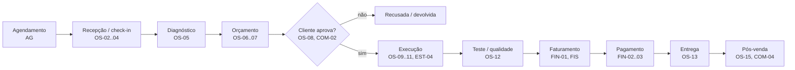
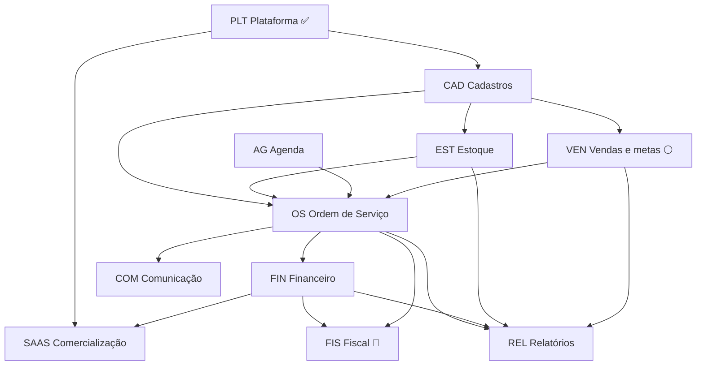

# MobiOS — Mapa de entregáveis

Tudo o que o produto deve entregar, por módulo, com as dependências entre eles.
Objetivo: **decidir o escopo completo antes de evoluir a arquitetura**. Este documento é a fonte para priorizar; a arquitetura (`ARQUITETURA.md`) segue o que for decidido aqui.

> **Como usar:** cada entregável tem um código (ex.: `OS-05`). Para priorizar, cortar ou mudar algo, cite o código.
> A coluna **Proposta** é a sugestão inicial e ainda precisa ser validada pelo dono do produto.

**Legenda:** ✅ pronto · 🟢 MVP (primeira versão vendável) · 🟡 v1.x (logo depois do MVP) · 🔵 `ee/` (módulo comercial pago) · ⚪ futuro/ideia

---

## 1. Quem usa o sistema

Definição do dono do produto:

| Perfil | Papel no sistema | O que faz |
|---|---|---|
| **Administrador** | `admin` | **Acesso a todas as funcionalidades**; configura o sistema e a equipe |
| **Atendente** | `atendente` | **Venda de peças no balcão, abertura de O.S., solicitação de serviços e entrega do veículo** (e, para isso, cadastra clientes e veículos); também **adiciona peças na O.S.** e **registra pagamentos** |
| **Mecânico** | `mecanico` | **Diagnóstico do carro, observações sobre o serviço, solicitação de peças para troca e confirmação da execução do serviço**. Usa o sistema diretamente, de preferência em tablet ou celular na oficina |
| **Almoxarife** | função padrão | **Adiciona as peças na O.S. aberta** (separa e dá baixa no estoque); consulta clientes, veículos, O.S. e estoque |
| **Financeiro** | `financeiro` | **Menu financeiro: faturamento, serviços em aberto e relatórios**; **registra pagamentos** |
| **Cliente final** | *sem login* | Aprovar orçamento, ser avisado quando o carro ficar pronto, receber o comprovante |
| **Operador do SaaS** (você) | *super-admin* ⚪ | Cadastrar oficinas, planos, cobrança, suporte |

### 1.1 Funções e permissões (configuráveis)

Definido pelo dono do produto: o admin configura em **Configurações → Funções e permissões**.

- O admin **cria, renomeia, desativa e reativa funções** (ex.: Almoxarife, Gerente). Excluir só a função **sem nenhum usuário** (ativo ou não); com usuário, apenas desativar. O Administrador nunca é excluído.
- Cada função tem um **nível por módulo**: *Sem acesso*, *Consultar* ou *Editar* (Relatórios: só *Sem acesso* ou *Consultar*). Módulos ainda não construídos já aparecem ("em breve") e controlam o menu.
- Um usuário pode ter **várias funções** e recebe o **maior nível** de cada módulo entre elas.
- **Administrador** é fixo, com acesso total, e é o único que gerencia **usuários, funções e configurações** (não entram na matriz).
- **Desativar uma função** retira na hora o acesso que vinha dela; reativar devolve. Mudanças valem na hora, inclusive para quem está logado.
- Limite conhecido do nível por módulo: quem pode *Editar* a O.S. faz todas as ações da O.S. (abrir, diagnosticar, confirmar execução, entregar).

**Parâmetros da função** (além dos níveis): marcam o que a função habilita. Hoje há um, **Vendedor** (quem pode ser cadastrado como vendedor, CAD-18).

**Módulos da matriz:** Clientes e veículos · **Orçamentos** · **Aprovar orçamentos** · **Aprovação comercial** · **Custos e margem** · Ordem de Serviço · **Peças na O.S.** · **Materiais** · **Serviços** · **Preços** · Estoque · **Recebimentos** · Financeiro · Relatórios.
*Aprovar orçamentos* é separado de *Orçamentos* para escolher quem registra a resposta do cliente (aprovação ou recusa). Desde 25/09/2026, só o Administrador e o **vendedor ativo** (nos próprios orçamentos, seja qual for a função) criam e alteram orçamentos; os demais só consultam, e aprovam se tiverem *Aprovar orçamentos* (regras em `docs/modulos/ORCAMENTOS.md` §5).
*Aprovação comercial* (Fase 6, 25/09/2026) é outra coisa: quem aprova ou reprova **desconto acima da alçada** (Consultar = ver; Editar = decidir até a própria alçada). Nenhuma função padrão o recebe; a alçada de cada função fica em Configurações → Alçadas de desconto (Administrador 100%, demais 0% até serem configuradas).
*Custos e margem* (25/09/2026): ver o PMC (preço médio de compra) do material e a análise de margem na aprovação comercial (Consultar) e alterar o PMC (Editar); informação interna, nunca mostrada ao vendedor. Nenhuma função padrão o recebe.
*Materiais* (materiais, categorias, marcas, depósitos) e *Preços* (tabelas e vigências) são separados para o almoxarife cadastrar peças sem mexer em preço (decisão de 23/09/2026).
Os módulos *Peças na O.S.* e *Recebimentos* existem para separar ações que, dentro da O.S., não devem ir para todos os que editam a O.S.: o mecânico edita a O.S. (diagnóstico, solicitar peças, execução), mas **não adiciona peças nem registra pagamento**.

**Funções iniciais** de toda oficina (editáveis; `FUNCOES_PADRAO` em `packages/shared/src/acessos.ts`):

| Função | Clientes/veículos | Orçamentos | Aprovar orç. | O.S. | Peças na O.S. | Materiais | Serviços | Preços | Estoque | Recebimentos | Financeiro | Relatórios |
|---|---|---|---|---|---|---|---|---|---|---|---|---|
| Administrador (fixo) | Editar | Editar | Editar | Editar | Editar | Editar | Editar | Editar | Editar | Editar | Editar | Consultar |
| Atendente | Editar | Editar | Editar | Editar | Editar | Consultar | Consultar | Consultar | Editar | Editar | — | — |
| Mecânico | Consultar | Consultar | — | Editar | — | Consultar | Consultar | — | Consultar | — | — | — |
| Almoxarife | Consultar | Consultar | — | Consultar | Editar | Editar | Consultar | Consultar | Consultar | — | — | — |
| Financeiro | Consultar | Editar | Editar | Consultar | — | Consultar | Editar | Editar | — | Editar | Editar | Consultar |

**Decisões do dono do produto (registro):**
- **Peças:** o **Almoxarife** adiciona a peça **na O.S. aberta**; o **Atendente** também pode. O Mecânico só solicita. Entradas de compra no estoque ficam com quem tem *Editar* no Estoque (Atendente).
- **Pagamento:** registrado pelo **Financeiro** ou pelo **Atendente**, tanto **na O.S.** (entrega) quanto **no módulo Financeiro** — sempre exigindo *Editar* em Recebimentos.

Efeitos já implementados: menu e atalhos da página inicial seguem os níveis; o indicador "Faturado hoje" exige Financeiro ≥ Consultar; o relatório de Usuários é só do Administrador; os de Clientes e Veículos exigem também Clientes/veículos ≥ Consultar.

## 2. Jornada do veículo na oficina

É a espinha dorsal do produto. Cada etapa aponta os entregáveis envolvidos.

---

## 3. Módulos e entregáveis

### PLT — Plataforma (base técnica)

| Código | Entregável | Proposta |
|---|---|---|
| PLT-01 | Multi-oficina com isolamento no banco (RLS) | ✅ |
| PLT-02 | Login, sessão, papéis e permissões por função | ✅ |
| PLT-03 | Admin inicial na instalação; gestão de usuários (sem exclusão, só desativação) | ✅ |
| PLT-04 | Style guide configurável (cores, botões), logo e login com a marca da oficina | ✅ |
| PLT-05 | Página inicial com atalhos, indicadores e alertas | ✅ (indicadores de O.S./financeiro chegam com esses módulos) |
| PLT-06 | Tudo em Docker (db, migrate, api, web) | ✅ |
| PLT-07 | **Alterar a própria senha** no "Meu perfil": exige a senha atual; errar a atual conta no limite de tentativas (PLT-08) | ✅ |
| PLT-15 | **Foto opcional do usuário** (admin na Equipe ou o próprio usuário em "Meu perfil"), exibida no topo e na Equipe; menu "Usuários" renomeado para "Equipe" | ✅ |
| PLT-08 | **Limite de tentativas de login**: 5 erros em 15 min por e-mail ou 20 por IP bloqueiam por 15 min (vale para o Administrador; bloqueio sempre temporário; mensagem não revela se o e-mail existe) | ✅ |
| PLT-09 | Recuperar senha por e-mail (exige servidor de e-mail/SMTP) | 🟡 |
| PLT-10 | Trilha de auditoria geral (quem alterou o quê e quando) | 🟡 |
| PLT-11 | Dados da oficina: razão social, CNPJ, endereço, telefone, IE/IM (usados na impressão da O.S. e na nota fiscal) | 🟢 |
| PLT-12 | Backup automático diário e restauração testada | 🟢 (antes do primeiro cliente real) |
| PLT-13 | **Funções configuráveis** com nível por módulo e várias funções por usuário (§1.1); **alçada de desconto por função** (Configurações → Alçadas de desconto) com aprovação comercial acima dela (`docs/modulos/APROVACAO_COMERCIAL.md`) | ✅ funções · ✅ alçada de desconto |
| PLT-14 | Autenticação em dois fatores (2FA) | ⚪ |

### CAD — Cadastros

| Código | Entregável | Proposta |
|---|---|---|
| CAD-01 | Clientes PF/PJ: CPF/CNPJ validado (inclusive o **CNPJ alfanumérico** da Receita, jul/2026), RG/IE, nascimento e sexo (só PF), telefone e WhatsApp obrigatórios, e-mail, observações, cliente desde, origem, tipo de relacionamento, status Ativo/Inativo | ✅ |
| CAD-02 | Endereços do cliente (ao menos um, um principal), com preenchimento pelo CEP (ViaCEP); na PJ, cada endereço pode ser também de faturamento, entrega e/ou cobrança | ✅ |
| CAD-03 | Responsáveis da PJ (obrigatório ao menos um, um principal): nome, função (lista editável em Configurações → Função do responsável), telefone (marcando se é WhatsApp) e e-mail | ✅ |
| CAD-04 | Veículos: placa antiga/Mercosul, chassi/VIN (opcional, 17 caracteres) e Renavam validados quando informados, marca/modelo com sugestões da própria oficina, versão, ano fabricação/modelo, cor, combustível, km, veículo principal, status Ativo/Vendido/Inativo, data da última visita (preenchida pela O.S.) | ✅ |
| CAD-05 | Marca e modelo por lista padronizada (tabela FIPE) em vez de texto livre | 🟡 |
| CAD-06 | Histórico do veículo: todas as O.S., km a cada visita, peças trocadas | 🟢 (chega com OS) |
| CAD-07 | **Catálogo de serviços** (mão de obra), em Ofertas → Serviços: código automático e imutável (exibido `000001`), nome (pode repetir), descrição, **forma de preço** (preço fechado ou **valor-hora**; no valor-hora as horas de referência são obrigatórias), horas de trabalho em horas:minutos, classificação (lista em Configurações), garantia em dias e km (só o campo, regras depois) e observação. **Preço nas mesmas Tabelas de Preço dos materiais** (vigências, preço padrão, trilha; no valor-hora o preço é o da hora). Lista com código, nome e situação; detalhe com abas Dados e Preços; importação por planilha; excluir só sem preço. Módulo de acesso **Serviços**; os preços seguem o módulo Preços | ✅ |
| CAD-08 | **Catálogo de peças/produtos** (ver EST) | 🟢 |
| CAD-09 | Fornecedores | 🟢 |
| CAD-10 | Mecânicos: especialidade e % de comissão | 🟢 |
| CAD-11 | Formas de pagamento e taxas (ex.: crédito 3,5%, prazo de recebimento) | 🟢 |
| CAD-12 | Transferir veículo de um cliente para outro (venda do carro), levando o histórico | ✅ |
| CAD-13 | Importar **clientes** de planilha CSV (uma linha por cliente, com endereço principal e, na PJ, responsável principal; CPF/CNPJ já cadastrado atualiza). Veículos por planilha: 🟡 | ✅ |
| CAD-14 | Listas editáveis por oficina: origem do cliente, tipo de relacionamento e função do responsável | ✅ |
| CAD-20 | **Configurações em submenu** (Aparência e logo · Funções e permissões · Origem do cliente · Tipo de relacionamento · Função do responsável · Tipos de material · Tipos de depósito · Classificação de serviço), uma página por item. Toda lista é **tabela parametrizável**: código automático e imutável, nome, descrição opcional e status; **excluir só o item sem nenhum registro associado**, senão apenas inativar | ✅ |
| CAD-15 | Máscaras de digitação: CPF, CNPJ (inclusive alfanumérico), telefone, CEP, e-mail, placa, chassi, Renavam, anos e km | ✅ |
| CAD-16 | Menu **Clientes** com submenu (Clientes · Veículos). Lista de clientes em tabela, 20 por página, com filtros: status, PF/PJ, período de "cliente desde", origem, tipo de relacionamento e aniversário; página **Veículos** com a frota inteira (busca por placa, marca, modelo ou dono) | ✅ |
| CAD-17 | **Aniversário do cliente (PF)**: selo na lista (hoje e próximos 7 dias), faixa no perfil no dia, e bloco no Início com atalho de WhatsApp para dar parabéns. Nascidos em 29/02 são lembrados em 28/02 nos anos não bissextos | ✅ |
| CAD-18 | **Vendedores** (Equipe → Vendedores, só o Administrador): código sequencial automático e imutável, usuário vinculado obrigatório (um vendedor por usuário, trocável), nome e e-mail do usuário, WhatsApp, matrícula opcional e única, funcionário desde (opcional). Lista em tabela (código, nome, matrícula, situação), busca por código, nome ou matrícula, filtro de situação, 20 por página; detalhes na linha com aba **Log de alterações** (campo, antes, depois, quem e quando) e janela só de leitura com os dados do usuário. Sem exclusão: inativar/reativar por botão. Importação por planilha CSV (sem código cadastra, com código atualiza). Serão ligados a clientes, oportunidades, orçamentos e O.S. | ✅ |
| CAD-19 | **Código sequencial** (por oficina, automático e imutável) em usuários e funções; **descrição** e **parâmetros** na função (catálogo `VENDEDOR`, já marcado no Atendente) | ✅ |

**Regras dos vendedores, decididas pelo dono do produto em 24/09/2026 (CAD-18):**
- Só pode ser vendedor o usuário **ativo** que tenha uma função **ativa** com o parâmetro **Vendedor** (Configurações → Funções e permissões; vem marcado no Atendente e o admin pode marcar em outras funções). O sistema nunca decide pelo nome da função.
- **Desativar o usuário**, tirar dele a função ou desmarcar o parâmetro/desativar a função **inativa o vendedor na hora**, com registro no log. Reativar o usuário não reativa o vendedor: o admin reativa depois (bloqueado enquanto o usuário não estiver apto).
- O vínculo com usuário é obrigatório e nunca fica vazio; pode ser trocado por outro usuário apto.

**Regras do cadastro, decididas pelo dono do produto em 22/09/2026:**
- Placa (obrigatória) e chassi (opcional) são únicos na oficina. Na venda para outro cliente, o veículo é **transferido** (CAD-12) e não recadastrado. As O.S. guardam o cliente da época, então o histórico do ex-dono continua com ele.
- **Cliente Inativo ou veículo Vendido/Inativo não recebe O.S. nova**, mas continua na busca e no histórico. Para atender de novo, basta reativar. Aplicar em OS-02.
- **Cadastro incompleto:** clientes e veículos anteriores a estas regras continuam válidos, marcados como "cadastro incompleto" com o que falta. **A O.S. só pode ser aberta depois de completar o cadastro** (aplicar em OS-02). A página inicial avisa quantos existem.
- A quilometragem é opcional no cadastro do veículo e **obrigatória na O.S.** (OS-02). A data da última visita é gravada pela O.S.

### OS — Ordem de Serviço (núcleo do produto)

| Código | Entregável | Proposta |
|---|---|---|
| OS-01 | Numeração sequencial por oficina, sem buracos | 🟢 |
| OS-02 | Abertura rápida: cliente + veículo + km de entrada (obrigatório) + relato do cliente. Bloqueia cliente inativo, veículo vendido/inativo e cadastro incompleto; atualiza km atual e última visita do veículo | 🟢 |
| OS-03 | **Checklist de entrada**: itens (estepe, macaco, som…), nível de combustível, avarias | 🟢 |
| OS-04 | **Fotos do veículo** na entrada (avarias) e durante o serviço | 🟢 |
| OS-05 | Diagnóstico técnico e **observações do mecânico** sobre o serviço | 🟢 |
| OS-06 | Itens da O.S.: serviços (do catálogo ou avulsos) e peças (do estoque ou avulsas), com quantidade, preço e desconto | 🟢 |
| OS-07 | Orçamento com validade, impressão/PDF e totais (serviços, peças, desconto, total) | 🟢 |
| OS-08 | **Aprovação do cliente**: total ou **parcial, por item**; registro de quem aprovou, quando e por qual meio (presencial, telefone, WhatsApp, link) | 🟢 |
| OS-09 | Fluxo de status (orçamento → aguardando aprovação → aprovada → em execução → aguardando peça → concluída → entregue; recusada; cancelada com motivo) | 🟢 |
| OS-10 | Atribuir mecânico(s) à O.S. ou a cada serviço | 🟢 |
| OS-11 | Apontamento de horas por mecânico (início/fim do serviço) | 🟡 |
| OS-12 | Serviço adicional descoberto durante a execução → novo orçamento dentro da mesma O.S. | 🟢 |
| OS-13 | Entrega: km de saída, observações, termo de entrega assinado | 🟢 |
| OS-14 | Impressão/PDF da O.S. com a marca da oficina | 🟢 |
| OS-15 | **Garantia** por serviço/peça (prazo e km) e O.S. de retorno em garantia vinculada à original | 🟡 |
| OS-16 | Quadro de acompanhamento (kanban) das O.S. por status, para a TV da oficina | 🟡 |
| OS-17 | Previsão de entrega e alerta de O.S. atrasada | 🟢 |
| OS-18 | **Tela do mecânico** otimizada para tablet/celular: suas O.S., diagnóstico, solicitar peças, confirmar execução | 🟢 (o mecânico usa o sistema diretamente) |
| OS-19 | Assinatura digital do cliente na tela (aprovação/entrega) | ⚪ |
| OS-20 | Pacotes de serviço (ex.: "Revisão 10.000 km" = serviços + peças pré-definidos) | 🟡 |
| OS-21 | **Solicitação de peças pelo mecânico**: pede a peça na O.S.; o **almoxarife ou o atendente** adiciona a peça na O.S. aberta, com baixa no estoque (módulo *Peças na O.S.*); peça sem estoque vira pendência de compra e status "aguardando peça" | 🟢 |
| OS-22 | **Confirmação de execução por serviço** pelo mecânico (quem e quando); a O.S. só pode ser concluída com todos os serviços aprovados confirmados | 🟢 |

### EST — Estoque

| Código | Entregável | Proposta |
|---|---|---|
| EST-01 | Cadastro de materiais: SKU, código de barras, descrição, tipo, categoria, marca, unidade, código do fabricante, dados fiscais e controles (ver `docs/modulos/MATERIAIS_E_PRECOS.md`). Custo e localização ficam com o estoque | ✅ |
| EST-11 | Categorias hierárquicas e marcas | ✅ |
| EST-12 | Cadastro de depósitos (local lógico; saldo por depósito vem com o estoque) | ✅ |
| EST-13 | Tabelas de preço e preço por vigência, com histórico, preços programados, consulta do preço vigente e trilha de auditoria | ✅ |
| EST-14 | Menu **Política Comercial** com submenu: **Linhas de Preço** (uma tabela por vez, de **materiais e serviços** com coluna e filtro de tipo; uma linha por vigência com preço, início, fim e situação, e outra para o preço padrão; filtro de situação que começa em vigentes, futuras e padrão; só preço, sem estoque; **cadastro manual de preço por SKU** e importação por planilha usando a tabela da tela) e **Tabelas de Preço** (lista em tabela; abrir uma tabela mostra as mesmas linhas de preço e o cadastro por SKU). Listas com 20 por página | ✅ |
| EST-16 | **Preço padrão** (sem vigência) por material e tabela: vale nos dias sem vigência; alterar ou remover fica na trilha | ✅ |
| EST-17 | **Importação de preços por planilha CSV** (colunas tabela, sku, preco, inicio, fim; 1ª linha = cabeçalho): grava as linhas válidas e lista as com erro, com o número da linha | ✅ |
| EST-15 | **Tabela de estoque** por SKU + depósito (20 por página): **disponível** (tudo o que há no depósito), **reservado** (parte dele, nunca maior) e **saldo = disponível − reservado** (livre; decisão de 24/09/2026, substitui o físico); ajuste manual com motivo e histórico, e **lançamento de saldo digitando SKU e depósito** (conferidos antes de gravar), até existir movimentação automática (EST-02, EST-04, EST-10) | ✅ |
| EST-19 | **Importação de materiais e de categorias por planilha CSV**: tipo, categoria (código ou caminho) e marca pelos cadastros existentes; SKU, código ou nome sob o mesmo pai já cadastrados atualizam | ✅ |
| EST-18 | **Importação de saldos por planilha CSV** (colunas sku, deposito, disponivel, reservado, motivo; 1ª linha = cabeçalho): cada linha informa o saldo final; grava as válidas e lista as com erro | ✅ |
| EST-20 | **Suprimento no material** (só cadastro, por enquanto): **múltiplo de venda** (caixa master; inteiro > 0, padrão 1) e **leadtime** (dias corridos; inteiro ≥ 0, padrão 30), no formulário, no detalhe e na importação. As regras de uso (venda em múltiplos, reposição) serão definidas depois | ✅ cadastro · ⚪ regras |
| EST-02 | Entrada manual (compra) com fornecedor, quantidade e custo | 🟢 |
| EST-03 | Entrada automática pela **importação do XML da nota fiscal do fornecedor** | 🟡 |
| EST-04 | Saída pela O.S.: **reserva** na aprovação e **baixa** na execução; estorno no cancelamento | 🟢 |
| EST-05 | Ajuste e inventário (contagem física) com motivo | 🟢 |
| EST-06 | Estoque mínimo e alerta de reposição | 🟢 |
| EST-07 | Custo médio ponderado e margem por peça | 🟢 |
| EST-08 | Sugestão de compra (abaixo do mínimo + reservado em O.S.) | 🟡 |
| EST-09 | Curva ABC e estoque parado | 🟡 |
| EST-10 | **Venda de peça no balcão**, sem O.S. (atendente), com baixa de estoque e pagamento | 🟢 (atribuição do atendente) |

### FIN — Financeiro

| Código | Entregável | Proposta |
|---|---|---|
| FIN-01 | Conta a receber gerada automaticamente ao concluir/faturar a O.S. | 🟢 |
| FIN-02 | **Registro de pagamentos**: Pix, crédito, débito, dinheiro, boleto, transferência; parcelado; vários meios na mesma O.S. Feito pelo **Financeiro ou Atendente**, na O.S. (entrega) ou no Financeiro (módulo *Recebimentos*) | 🟢 |
| FIN-03 | Recibo/comprovante de pagamento | 🟢 |
| FIN-04 | Contas a pagar: fornecedores e despesas fixas (aluguel, energia) | 🟢 |
| FIN-05 | **Caixa diário**: abertura, entradas, saídas, sangria, fechamento com conferência | 🟢 |
| FIN-06 | Comissão de mecânicos (sobre mão de obra, peças ou ambos) | 🟡 |
| FIN-07 | Fluxo de caixa (realizado e previsto) | 🟡 |
| FIN-08 | DRE simplificado (receita, custo das peças, despesas, resultado) | 🟡 |
| FIN-09 | Controle de inadimplência e lembrete de cobrança | 🟡 |
| FIN-10 | Conciliação com extrato bancário (arquivo OFX) | ⚪ |
| FIN-11 | Cobrança integrada (Pix com QR Code, link de pagamento, baixa automática) via gateway | 🔵 |

### FIS — Fiscal

| Código | Entregável | Proposta |
|---|---|---|
| FIS-01 | **NFS-e** (nota de serviço, municipal: cada prefeitura tem regras próprias) | 🔵 |
| FIS-02 | **NF-e / NFC-e** (nota de peças, estadual) | 🔵 |
| FIS-03 | Certificado digital A1 da oficina (upload e validade) | 🔵 |
| FIS-04 | Cancelamento e carta de correção | 🔵 |
| FIS-05 | Envio da nota ao cliente por e-mail/WhatsApp | 🔵 |
| FIS-06 | Exportação para o contador (XMLs do mês) | 🔵 |

> ⚠️ O fiscal é o módulo de **maior risco e custo** (varia por município e estado). O caminho usual é um provedor de emissão, como Focus NFe, PlugNotas ou NFE.io, pago por nota emitida. Sem nota fiscal, muitas oficinas não conseguem adotar o sistema, então esse item pesa na hora de vender.

### AG — Agenda

| Código | Entregável | Proposta |
|---|---|---|
| AG-01 | Agendamento de serviço (cliente, veículo, data/hora, serviço previsto) | 🟡 |
| AG-02 | Capacidade por box/elevador e por mecânico | 🟡 |
| AG-03 | Converter agendamento em O.S. na chegada | 🟡 |
| AG-04 | Agendamento online pelo cliente | ⚪ |

### COM — Comunicação com o cliente

| Código | Entregável | Proposta |
|---|---|---|
| COM-01 | Botão "enviar pelo WhatsApp" com mensagem pronta (link `wa.me`, sem custo nem integração) | 🟢 |
| COM-02 | **Link público do orçamento** para o cliente aprovar ou recusar pelo celular | 🟢 |
| COM-03 | Aviso "veículo pronto" | 🟢 (via COM-01) |
| COM-04 | Lembrete de revisão por data/km | 🟡 |
| COM-05 | Pesquisa de satisfação pós-entrega | ⚪ |
| COM-06 | WhatsApp automático via API oficial (Meta), com envio sem clique | 🔵 |
| COM-07 | Portal do cliente: histórico de O.S. e notas | ⚪ |

### VEN — Vendas e metas (roadmap)

Planejado, **sem desenvolvimento iniciado**, sobre o cadastro de vendedores (CAD-18). Escopo e prioridade ainda a definir (ver §7, item 10).

| Código | Entregável | Proposta |
|---|---|---|
| VEN-01 | Cadastro de oportunidades: cliente, veículo (opcional), origem, vendedor responsável, valor estimado e etapa | ⚪ |
| VEN-02 | **Orçamentos** (menu Orçamentos; regras em `docs/modulos/ORCAMENTOS.md`): número ORC-0000000001 por oficina e **versões** (nova versão = mesmo número, cancela a anterior; só a última aprova); cliente obrigatório (inativo ou incompleto aceito, com alerta), veículo opcional do cliente, vendedor ativo obrigatório e tabela de preço (a **padrão** já vem escolhida). Materiais ativos com "Permite venda" e serviços ativos, **só com preço na tabela no dia**; quantidade arredondada para cima ao múltiplo de venda (valor-hora: múltiplos das horas do serviço). **Negociação só de material**, por percentual (até 2 casas, desconto arredondado a favor do cliente) ou preço digitado, nunca acima da tabela, com o preço cheio riscado. Troca de tabela recalcula ao preço cheio (com confirmação) e remove itens sem preço; rascunho aberto em outro dia é recalculado (o cliente mantém o valor se o preço subiu). Ciclo rascunho → emitido → enviado → aprovado / recusado / vencido / cancelado; validade de 7 dias por padrão, no máximo 30, **vencido automático** no dia seguinte ao último dia para aprovar (validade + 1). Aprovação com data, hora e usuário; recusa e cancelamento com motivo opcional; histórico. **Alçada de desconto:** acima da alçada de quem emite, o orçamento aguarda **aprovação comercial** (motor genérico, pronto para Pedido de Venda e O.S. quando existirem; `docs/modulos/APROVACAO_COMERCIAL.md`). Sem PDF, link público, reserva de estoque, oportunidade e conversão em O.S. ou pedido de venda (virão depois) | ✅ orçamento · ⚪ oportunidade e conversão |
| VEN-03 | Gestão de metas de vendedores: meta por vendedor e período | ⚪ |
| VEN-04 | Acompanhamento das metas: realizado × meta por vendedor | ⚪ |

### REL — Relatórios e indicadores

| Código | Entregável | Proposta |
|---|---|---|
| REL-01 | Extração em CSV: clientes, veículos, usuários | ✅ |
| REL-02 | O.S. por período e status; O.S. atrasadas | 🟢 |
| REL-03 | Faturamento por dia/mês, separado em serviços e peças | 🟢 |
| REL-04 | Ticket médio, taxa de aprovação de orçamentos | 🟢 |
| REL-05 | Serviços e peças mais vendidos; margem por peça | 🟡 |
| REL-06 | Produtividade por mecânico (O.S., horas, faturamento) | 🟡 |
| REL-07 | Posição de estoque, estoque abaixo do mínimo, estoque parado | 🟢 |
| REL-08 | Contas a receber/pagar, inadimplência, fechamento de caixa | 🟢 |
| REL-09 | Exportação em Excel (.xlsx) e PDF, além de CSV | 🟡 |

**Indicadores da página inicial**, à medida que os módulos chegam: O.S. em aberto, O.S. atrasadas, veículos aguardando aprovação, aguardando peça, faturado hoje/mês, ticket médio, a receber hoje, contas a vencer, estoque abaixo do mínimo.

### SAAS — Comercialização

| Código | Entregável | Proposta |
|---|---|---|
| SAAS-01 | Deploy em VPS com HTTPS, domínio e backup | 🟢 (para o primeiro cliente) |
| SAAS-02 | Painel do operador (super-admin): criar oficina, ver uso, suporte | 🟡 |
| SAAS-03 | Cadastro self-service de oficina com período de teste | 🟡 |
| SAAS-04 | Planos e limites (usuários, O.S./mês, módulos `ee/`) | 🟡 |
| SAAS-05 | Cobrança recorrente da assinatura (gateway) | 🟡 |
| SAAS-06 | Endereço próprio por oficina (subdomínio) no login | 🟡 |
| SAAS-07 | LGPD: termo de uso, exportação e exclusão de dados do titular | 🟢 (antes de vender) |
| SAAS-08 | Monitoramento, alertas de erro e logs centralizados | 🟡 |
| SAAS-09 | Documentação de uso e onboarding guiado | 🟡 |

---

## 4. Dependências entre módulos

Ordem natural de construção: **CAD (serviços, peças, fornecedores, mecânicos) → OS → EST (integrado à OS) → FIN → REL/indicadores → COM → SAAS/FIS**.
O estoque pode começar junto com a O.S.: as peças da O.S. já nascem ligadas ao estoque, sem retrabalho depois.

## 5. Proposta de corte do MVP

**MVP = uma oficina consegue operar o dia inteiro só com o MobiOS, sem papel e sem planilha.**

- **Entra:** PLT-07, 08, 11, 12 · CAD-02, 06–11 · OS-01–10, 12–14, 17, 18, 21, 22 · EST-01, 02, 04–07, 10 · FIN-01–05 · COM-01–03 · REL-02–04, 07, 08 · SAAS-01, 07
- **Fica para a v1.x:** agenda, garantia, comissões, apontamento de horas, kanban, importação de XML, DRE, cobrança da assinatura, painel SaaS
- **Módulos comerciais (`ee/`):** fiscal, cobrança integrada, WhatsApp automático

## 6. Impactos na arquitetura (decidir antes de construir)

| Tema | Por que importa | Entregáveis |
|---|---|---|
| **Fotos e PDFs** | Volume bem maior que o logo. No banco (regra atual) é simples, mas o banco e o backup crescem rápido. Decidir limite, compressão e quando migrar para storage S3 | OS-04, OS-07, OS-14 |
| **Rotas públicas com token** | O link de aprovação do orçamento é acessado pelo cliente sem login: precisa de token forte, expiração e registro de uso | COM-02, OS-08 |
| **Trabalho em segundo plano** | Lembretes, alertas e envio de mensagens não podem rodar dentro da API (regra de escalabilidade): exige um processo `worker` | COM-04, COM-06, EST-06, FIN-09 |
| **E-mail (SMTP)** | Recuperar senha e enviar nota/orçamento exigem um provedor de e-mail | PLT-09, FIS-05 |
| **Transações com estoque** | Reserva e baixa de peças precisam ser atômicas e sem corrida entre duas O.S. (trava de linha no banco) | EST-04 |
| **Numeração sem buracos** | Número da O.S. (e depois da nota) gerado no banco, dentro da transação | OS-01 |
| **Integrações externas** | CEP e FIPE são serviços de terceiros: precisam de cache e plano B quando estiverem fora do ar | CAD-02, CAD-05 |
| **Impressão** | Layout de O.S. e recibo em PDF (A4 e bobina de 80 mm?) | OS-07, OS-14, FIN-03 |

## 7. Decisões em aberto (para o dono do produto)

1. **Nota fiscal no MVP?** Sem ela, a oficina continua usando outro sistema para emitir. Em qual município fica a primeira oficina-cliente?
2. **Aprovação por link (COM-02)** entra no MVP, ou aprovação presencial/telefone basta no início?
3. **Aprovação parcial por item** (o cliente aprova a troca de pastilha e recusa o amortecedor) é necessária?
4. **Fotos:** quantas por O.S., em média? Guardar no banco (atual) ou já prever storage?
5. **Impressão:** A4, impressora térmica de 80 mm ou as duas?
6. **Comissão de mecânicos:** sobre o quê (mão de obra, peças, lucro) e com que frequência é paga?
7. ~~Mecânico usa o sistema diretamente?~~ **Decidido: sim** (personas, §1). Falta saber: haverá um tablet por mecânico/box ou um compartilhado? Isso define o login (individual ou troca rápida de usuário).
8. **Agenda** é necessária no MVP?
9. **Oficina-piloto:** existe uma oficina real para validar o MVP? Ela usa algum sistema hoje (para importar os dados)?
10. **Vendas e metas (VEN):** quais são as etapas da oportunidade? O orçamento avulso (VEN-02) substitui o orçamento dentro da O.S. (OS-07) ou convive com ele? A meta é medida em valor faturado, em quantidade ou nos dois? É mensal? Quem é "vendedor" (nova função ou o consultor técnico)? Em que fase entra?
