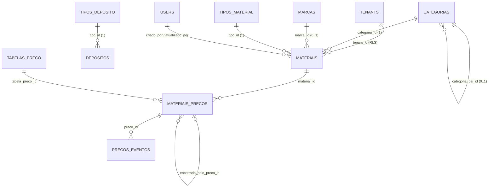

# Módulo Materiais e Preços

Cadastros mestres de **material, categoria, marca, depósito, tabela de preço e preço por vigência**.
Fora do escopo (outros módulos, que vão **usar** estes cadastros): estoque/saldo/reserva/movimentação, inventário, compras, fornecedores, vendas, O.S., fiscal e financeiro.

> Implementação: `packages/shared/src/materiais.ts` (regras e schemas), `apps/api/src/modules/{materiais,categorias,marcas,depositos,tabelas-preco,precos}`, `apps/api/drizzle/0012_materiais_precos.sql`, telas em `apps/web/src/pages/` (Materiais, MaterialForm, MaterialDetalhe, PrecosMaterial, Categorias, Marcas, Depositos, TabelasPreco). Testes: `apps/api/src/materiais.test.ts` e `packages/shared/src/materiais.test.ts`.

> **Ampliação de 23/09/2026 (pedido do dono do produto):** entraram a **lista de preços** no menu e a **tabela de estoque** (saldo por SKU + depósito com disponível e reservado, ajuste manual com motivo). Ver §21. Movimentação automática (compra, venda, O.S.), inventário e transferência continuam fora.

**Convenção de nomes do MobiOS:** a PK de toda tabela chama-se `id` (UUID); onde a especificação diz `material_id`, `categoria_id`, etc., a PK física é `materiais.id`, `categorias.id`... e as FKs nas outras tabelas mantêm o nome `material_id`, `categoria_id`. Colunas de auditoria em português: `criado_em`, `atualizado_em`, `criado_por`, `atualizado_por`.

## Decisões do dono do produto (23/09/2026)

| Tema | Decisão |
|---|---|
| Entrega | Documento + implementação (banco, API, telas, testes) |
| Permissão | Dois módulos na matriz de funções: **Materiais** (materiais, categorias, marcas, depósitos) e **Preços** (tabelas e vigências) |
| Preço já vigente | O valor **nunca** é editado. Uma nova vigência **encerra automaticamente** a atual no dia anterior. Preço futuro pode ser editado (valor/fim) ou cancelado |
| Moeda / filial | Só **BRL** (campo `moeda` existe, pronto para crescer). **Sem filial**: cada oficina já é um tenant; multi-filial fica para depois |

---

## 1. Resumo arquitetural

- **Multi-tenant com RLS**, como todo o MobiOS: toda tabela tem `tenant_id` + política de isolamento; toda FK entre tabelas de negócio é **composta** `(tenant_id, x_id)` (checagem de FK ignora RLS).
- **Chave técnica × chave de negócio:** PK UUID (`id`); SKU, códigos de depósito e de tabela são **únicos por oficina** e nunca usados como PK (podem mudar, podem colidir entre oficinas, e não amarram as FKs futuras de estoque/vendas).
- **Classificações que variam por oficina** (tipo de material, tipo de depósito) são **tabelas parametrizáveis** editadas em Configurações (uma página por lista: código automático, nome, descrição e status; exclusão só sem uso). **Domínios definidos por norma** (unidade de medida, origem fiscal, moeda) são fixos no código (ENUM/CHECK).
- **Preço = histórico imutável por vigência.** A tabela `materiais_precos` é o próprio histórico; nada é apagado. A **não sobreposição** é garantida no banco por uma constraint `EXCLUDE USING gist` sobre `daterange` — vale mesmo com gravações simultâneas ou fora da API.
- **Concorrência:** unicidade por índices únicos; vigências por EXCLUDE + trava consultiva (`pg_advisory_xact_lock`) por material+tabela; ciclo de categorias por trigger com trava por oficina; **edição otimista** com coluna `versao` (quem salva com versão velha recebe 409).
- **Auditoria:** `criado_por/atualizado_por/criado_em/atualizado_em` nos cadastros; trilha **`precos_eventos`** (antes/depois em JSON) para toda mudança de preço.
- **Exclusão:** física só do que nunca foi usado (FKs `RESTRICT`); o resto é **inativado**.

## 2. Entidades

| Entidade | Tabela | Papel |
|---|---|---|
| MATERIAL | `materiais` | Produto/peça: cadastro mestre |
| CATEGORIA | `categorias` | Classificação hierárquica (pai/filha) |
| MARCA | `marcas` | Fabricante |
| DEPÓSITO | `depositos` | Local lógico de armazenamento (sem saldo) |
| TABELA_PRECO | `tabelas_preco` | Lista de preços (Varejo, Oficina...) |
| MATERIAL_PRECO | `materiais_precos` | Preço do material numa tabela durante uma vigência |
| *Auxiliar* | `tipos_material` | Tipo de material, editável por oficina |
| *Auxiliar* | `tipos_deposito` | Tipo de depósito, editável por oficina |
| *Auxiliar* | `precos_eventos` | Trilha de auditoria das vigências |

**Entidades avaliadas e não criadas:** subcategoria (é a própria categoria na hierarquia), unidade de medida como tabela (é norma, não varia por oficina), moeda como tabela (só BRL; CHECK ISO 4217 já prepara), filial (decisão acima), tipo de tabela de preço (ver §4.4).

## 3. Diagrama de relacionamento



Cardinalidades: CATEGORIA 1:N MATERIAL · MARCA 1:N MATERIAL (marca opcional) · MATERIAL 1:N MATERIAL_PRECO · TABELA_PRECO 1:N MATERIAL_PRECO · CATEGORIA 1:N CATEGORIA (auto-relacionamento) · DEPÓSITO não se relaciona com os demais **ainda** (o estoque fará DEPÓSITO 1:N SALDO N:1 MATERIAL).

## 4. Modelo detalhado de cada tabela

Colunas comuns a **todas**: `id uuid PK default gen_random_uuid()`, `tenant_id uuid NOT NULL default app.tenant_id FK tenants`, `criado_em timestamptz NOT NULL default now()`, `atualizado_em timestamptz NOT NULL default now()`.
Colunas de **autoria** (materiais, categorias, marcas, depositos, tabelas_preco): `criado_por uuid FK users`, `atualizado_por uuid FK users`, `versao integer NOT NULL default 1` (concorrência otimista).

### 4.1 `materiais`

| Campo | Tipo | Obrig. | Chave/Default | Descrição e decisão |
|---|---|---|---|---|
| sku | text (≤40) | **Sim** | UNIQUE (tenant, sku); CHECK maiúsculo | Chave de negócio. Normalizado em maiúsculas, sem espaços (`A-Z 0-9 . _ / -`) |
| codigo_barras | text | Não | UNIQUE parcial (tenant) quando informado | EAN/GTIN 8/12/13/14 com dígito verificador |
| descricao | text (3–120) | **Sim** | índice trigram | Nome completo do produto |
| descricao_curta | text (≤40) | Não | | Etiquetas, cupons, telas estreitas |
| tipo_id | uuid | **Sim** | FK `tipos_material` | Tipo parametrizável (§4.7) |
| categoria_id | uuid | **Sim** | FK `categorias` | Categoria mais específica; a "subcategoria" é derivada da hierarquia |
| marca_id | uuid | Não | FK `marcas` | Insumos e itens genéricos não têm marca. Nunca texto solto |
| unidade | enum `unidade_medida` | **Sim** | | UN, PC, PAR, JG, KIT, CX, L, ML, KG, G, M (L, KG e M fracionáveis) |
| codigo_fabricante | text (≤40) | Não | índice (tenant, codigo_fabricante) | Part number; muito usado na busca do balcão |
| ncm | char(8) | Não | | Fiscal; validado (8 dígitos). Obrigatoriedade virá do módulo fiscal |
| cest | char(7) | Não | | Fiscal (substituição tributária) |
| origem | smallint | Não | CHECK 0–8 | Origem da mercadoria (tabela da NF-e) |
| controla_estoque | boolean | Sim | true | Lido pelo estoque |
| permite_venda / permite_compra / permite_uso_os | boolean | Sim | true | Lidos por vendas, compras, O.S. |
| controla_lote / controla_serie | boolean | Sim | false | Lidos pelo estoque (lote: óleos; série: baterias) |
| multiplo | integer | Sim | 1 | Múltiplo de venda (caixa master): vendido só em múltiplos desta quantidade; inteiro > 0 (CHECK). Vazio no formulário ou na planilha = 1. Regras de uso: a definir |
| leadtime_dias | integer | Sim | 30 | Tempo de ressuprimento em dias corridos; inteiro ≥ 0 (CHECK). Vazio = 30. Regras de uso: a definir |
| ativo | boolean | Sim | true | Desativação lógica |

**Campos avaliados e decisões**

- **Obrigatórios:** sku, descrição, tipo, categoria, unidade (mínimo para identificar, classificar e movimentar o item).
- **Opcionais:** código de barras, descrição curta, marca, código do fabricante, NCM, CEST, origem.
- **Derivados (não armazenados):** subcategoria e caminho da categoria (`Peças › Motor › Filtros`, calculado por CTE recursiva); situação do material no estoque; preço atual (consulta em `materiais_precos`).
- **Pertencem a outras entidades:** preço (→ `materiais_precos`); custo e custo médio (→ estoque/compras); saldo e localização na prateleira (→ estoque por depósito); fornecedor (→ compras); aplicação/compatibilidade com veículos (→ futuro catálogo de aplicações).
- **Não criados agora:** peso e dimensões — servem a frete/e-commerce, que não estão no escopo; entram numa extensão logística sem mudar o que existe.

### 4.2 `categorias`

| Campo | Tipo | Obrig. | Chave | Descrição |
|---|---|---|---|---|
| codigo | text (≤20) | Não | UNIQUE parcial (tenant, codigo) | Código opcional, maiúsculo |
| nome | text (2–80) | Sim | UNIQUE (tenant, coalesce(pai, zero), lower(nome)) | Único **entre irmãs** (pode repetir em outro ramo) |
| descricao | text | Não | | |
| categoria_pai_id | uuid | Não | FK composta → categorias; CHECK ≠ id; índice | NULL = nível principal |
| ativa | boolean | Sim | default true | |

Regras: sem duplicidade no mesmo nível (índice único); sem ser filha de si mesma (CHECK); **sem ciclo** (trigger `categorias_sem_ciclo` com CTE recursiva e trava por oficina); não exclui com materiais ou subcategorias (FK RESTRICT).

### 4.3 `marcas`

`codigo` (opcional, único), `nome` (único sem diferenciar maiúsculas), `descricao`, `ativa`.

### 4.4 `tabelas_preco`

| Campo | Tipo | Obrig. | Chave | Descrição |
|---|---|---|---|---|
| codigo | text (≤20) | Sim | UNIQUE (tenant, codigo) | Ex.: VAREJO, OFICINA — usado nas integrações |
| nome | text | Sim | UNIQUE (tenant, lower(nome)) | |
| descricao | text | Não | | |
| moeda | char(3) | Sim | default 'BRL'; CHECK `^[A-Z]{3}$` | API aceita só BRL por enquanto |
| ativa | boolean | Sim | true | |

**"Tipo" de tabela: não criado.** O tipo (varejo, atacado, seguradora) não muda nenhuma regra neste módulo; seria redundante com código e nome. Quando uma regra depender dele (ex.: tabela para convênio de seguradora), entra como tabela parametrizável.

### 4.5 `materiais_precos`

| Campo | Tipo | Obrig. | Chave | Descrição |
|---|---|---|---|---|
| material_id | uuid | Sim | FK composta → materiais | |
| tabela_preco_id | uuid | Sim | FK composta → tabelas_preco | |
| preco_centavos | bigint | Sim | CHECK ≥ 0 | Dinheiro sempre em centavos (inteiro) |
| data_inicio | date | Sim | | Primeiro dia (inclusivo) |
| data_fim | date | Não | CHECK ≥ data_inicio | Último dia (inclusivo); **NULL = vigência aberta** |
| cancelado | boolean | Sim | false | Exclusão lógica (só de preço futuro) |
| motivo_cancelamento / cancelado_em / cancelado_por | | Se cancelado | CHECK motivo quando cancelado | |
| encerrado_pelo_preco_id | uuid | Não | FK → materiais_precos | Qual nova vigência encerrou esta automaticamente |
| data_fim_anterior | date | Não | | Fim antes do encerramento automático (para desfazer) |
| criado_por / atualizado_por | uuid | | FK users | |

Constraint crítica: `EXCLUDE USING gist (tenant_id WITH =, material_id WITH =, tabela_preco_id WITH =, daterange(data_inicio, data_fim, '[]') WITH &&) WHERE (NOT cancelado)`.

### 4.6 `depositos`

| Campo | Tipo | Obrig. | Chave | Descrição |
|---|---|---|---|---|
| codigo | text (≤20) | Sim | UNIQUE (tenant, codigo) | |
| nome | text | Sim | UNIQUE (tenant, lower(nome)) | |
| descricao | text | Não | | |
| tipo_id | uuid | Sim | FK `tipos_deposito` | Loja, Oficina, Central, Garantia, Trânsito, Outro |
| permite_venda / permite_uso_os / permite_transferencia | boolean | Sim | true | Comportamento explícito (o tipo é só descritivo) |
| ativo | boolean | Sim | true | |

Avaliados e **fora**: filial (decisão do produto); endereço (o depósito é lógico e fica na oficina, que já tem endereço no tenant; não há entidade de endereço de oficina); saldo/reserva (estoque).

### 4.7 `tipos_material`, `tipos_deposito`

Mesma estrutura das listas editáveis já existentes: `nome` (único por oficina, sem diferenciar maiúsculas), `ativa`. Semeadas com PEÇA, ACESSÓRIO, PNEU, LUBRIFICANTE, FLUIDO, INSUMO, OUTRO e LOJA, OFICINA, CENTRAL, GARANTIA, TRÂNSITO, OUTRO.

**Por que tabela parametrizável e não ENUM:** o tipo varia de oficina para oficina (uma loja de pneus quer "Pneu de carga", "Câmara"...) e não dispara regra de sistema — regras vêm dos **indicadores explícitos** do material/depósito (`controla_estoque`, `permite_venda`...). ENUM exigiria migração a cada tipo novo.

### 4.8 `precos_eventos`

`preco_id` (FK), `evento` (enum: criado, alterado, encerrado, cancelado, reaberto), `antes jsonb`, `depois jsonb`, `usuario_id`, `criado_em`. Índice (preco_id, criado_em).

## 5. PKs e FKs

- PK: `id uuid` em todas.
- Alvo de FK composta: `UNIQUE (tenant_id, id)` em todas as tabelas referenciadas.
- FKs (todas compostas com `tenant_id`, `ON DELETE RESTRICT`): materiais → tipos_material, categorias, marcas, users (autoria); categorias → categorias (pai); depositos → tipos_deposito; materiais_precos → materiais, tabelas_preco, materiais_precos (encerrado_pelo), users; precos_eventos → materiais_precos, users.

## 6. Unique constraints

| Tabela | Unicidade |
|---|---|
| materiais | (tenant, sku); (tenant, codigo_barras) onde não nulo |
| categorias | (tenant, codigo) onde não nulo; (tenant, pai, lower(nome)) |
| marcas | (tenant, codigo) onde não nulo; (tenant, lower(nome)) |
| depositos | (tenant, codigo); (tenant, lower(nome)) |
| tabelas_preco | (tenant, codigo); (tenant, lower(nome)) |
| tipos_* | (tenant, lower(nome)) |
| materiais_precos | **EXCLUDE** de sobreposição (substitui e é mais forte que `UNIQUE(material, tabela, data_inicio)`, que seria redundante) |

## 7. Índices

| Índice | Uso |
|---|---|
| `materiais_sku_unico` (B-tree) | Busca exata e por prefixo do SKU |
| `materiais_codigo_barras_unico` | Leitor de código de barras |
| `materiais (tenant, codigo_fabricante)` | Busca por part number |
| `materiais_descricao_trgm` (GIN pg_trgm) | Busca por trecho da descrição (`ILIKE '%óleo%'`) em milhões de linhas |
| `materiais (tenant, categoria_id)`, `(tenant, marca_id)`, `(tenant, tipo_id)` | Filtros e contagem de uso |
| `materiais (tenant, ativo, descricao)` | Lista padrão (ativos, ordenados) |
| `categorias (categoria_pai_id)` | Árvore e filtro com subcategorias |
| `materiais_precos_consulta (material_id, tabela_preco_id, data_inicio DESC)` | Preço vigente e histórico |
| GiST da constraint EXCLUDE | Também atende consulta por intervalo |
| `materiais_precos (tabela_preco_id)`, `(encerrado_pelo_preco_id)` | Contagem por tabela; desfazer encerramento |

## 8. Regras de negócio

| Regra | Interface | API (Zod + rota) | Banco |
|---|---|---|---|
| SKU obrigatório, formato, único | máscara maiúscula | normaliza e valida formato | UNIQUE + CHECK maiúsculo |
| Código de barras válido e único | máscara numérica | dígito verificador GTIN | UNIQUE parcial |
| Categoria/marca/tipo válidos e ativos | só lista ativos | existe e está ativo (mantém o atual se inativado depois) | FK composta |
| Categoria sem ciclo / sem ser filha de si | não oferece descendentes | — | trigger + CHECK |
| Preço ≥ 0 | máscara de moeda | Zod | CHECK |
| Moeda válida | lista | enum BRL | CHECK ISO |
| Início ≤ fim | `min` no campo | Zod | CHECK |
| Não sobreposição | aviso | regras de vigência (§9) | **EXCLUDE** |
| Início não retroativo | `min` = hoje | 400 | — (regra de negócio) |
| Não excluir referenciado | só oferece inativar | 409 com orientação | FK RESTRICT |
| Edição concorrente | envia a versão lida | 409 se a versão mudou | coluna `versao` |

Regra de ouro: **toda regra crítica existe no backend/banco**; a interface só antecipa o erro.

## 9. Regra de vigência de preços

Definições: vigência = intervalo **fechado** `[data_inicio, data_fim]`; `data_fim NULL` = **aberta** (vale até outra vigência começar). Datas no fuso de Brasília. Para o mesmo material + tabela, vigências não canceladas **nunca se sobrepõem**.

| Situação | Condição (em relação a hoje) |
|---|---|
| Futura | `data_inicio > hoje` |
| Vigente | `data_inicio ≤ hoje` e (`data_fim` nula ou `≥ hoje`) |
| Encerrada | `data_fim < hoje` |
| Cancelada | `cancelado = true` (ignorada nas regras de sobreposição) |

**Nova vigência** (tudo dentro de uma transação com trava por material + tabela):

1. `data_inicio ≥ hoje` — o passado não é reescrito.
2. Se já existe vigência começando **no mesmo dia** → 409 (edite a existente, se futura).
3. Havendo **preço futuro depois** do início: fim vazio → a nova termina na véspera dele (**alteração programada** preservada); fim informado que invade o futuro → 409.
4. Se há vigência **valendo no dia do início** (a "atual"):
   - a nova cobre o resto do período dela (fim vazio, ou fim ≥ fim da atual) → a atual é **encerrada na véspera**, guardando `data_fim_anterior` e `encerrado_pelo_preco_id`;
   - a nova termina **antes** do fim da atual → **409** (partiria a atual em duas, com buraco — é o caso "01/01–31/12 + 01/06–30/09" da especificação).
5. Grava, registra eventos (`criado` na nova, `encerrado` na atual). A constraint EXCLUDE é a última barreira.

**Edição de preço:** vigente ou encerrado → **nunca** (409: cadastre nova vigência). Futuro → pode mudar **valor e fim**; para mudar o início, cancele e cadastre de novo (mantém o encerramento automático coerente).

**Encerrar:** vigente ou futuro; novo fim ≥ hoje e ≥ início; ampliar sobre outro preço → 409 (EXCLUDE).

**Cancelar (exclusão):** só preço **futuro**, com motivo obrigatório; o registro fica no histórico. Se ele tinha encerrado automaticamente a vigência anterior, esta **volta ao fim original** (evento `reaberto`). Exclusão física de preço **não existe**.

Exemplo (hoje = 23/09/2026, tabela VAREJO):

| Ação | Resultado |
|---|---|
| R$ 100 a partir de 23/09 | [23/09 → aberta] vigente |
| R$ 110 a partir de 03/10 | 100 fecha em 02/10; 110 [03/10 → aberta] futura |
| R$ 105 a partir de 28/09 (sem fim) | 100 fecha em 27/09; 105 [28/09 → 02/10] (termina antes do 110) |
| Cancelar o 105 | 105 cancelado; 100 volta a [23/09 → 02/10] |
| R$ 95 de 28/09 a 30/09 | 409: terminaria no meio do preço vigente |

## 10. Estratégia de consulta do preço vigente

```sql
SELECT p.*
FROM materiais_precos p
WHERE p.material_id = :material AND p.tabela_preco_id = :tabela
  AND NOT p.cancelado
  AND p.data_inicio <= :data
  AND (p.data_fim IS NULL OR p.data_fim >= :data)
LIMIT 1;
```

- Retorna **exatamente um** preço ou nenhum: a constraint EXCLUDE torna impossível haver dois (o `LIMIT 1` é só economia).
- Resolve **futuro** (não aparece antes do início), **atual**, **histórico** (qualquer data passada), **ausência** (`preco: null`) e **aberta** (fim nulo).
- Usa o índice `(material_id, tabela_preco_id, data_inicio DESC)`: o custo não cresce com o tamanho do histórico total, só com o número de vigências daquele material nessa tabela.
- API: `GET /api/precos/vigente?sku=ABC123&tabela=VAREJO&data=2026-09-23` (ou por ids). Material/tabela inativos continuam respondendo, com `ativo/ativa` na resposta — quem decide se vende é o módulo de vendas.

## 11. Regras de ativação/inativação

| Registro inativo | Efeito | Continua consultável |
|---|---|---|
| Material | Não recebe preço novo; futuros módulos não o oferecem em venda/compra/O.S. | Sim: cadastro, histórico de preços, consulta de preço vigente |
| Categoria | Não pode ser escolhida para material nem como pai | Sim; materiais que já usam mantêm |
| Marca / tipo | Não podem ser escolhidos | Sim; quem já usa mantém |
| Depósito | Futuro estoque não movimenta nele | Sim |
| Tabela de preço | Não recebe preço novo | Sim: histórico e consulta vigente |
| Preço | Não há "inativo": futuro → **cancelado**; vigente → **encerrado** | Sempre (histórico) |

Excluir fisicamente só o que **nunca foi usado** (categoria sem materiais/subcategorias, marca sem materiais, material sem preços, tabela sem preços, depósito sem referência).

## 12. Auditoria

- Cadastros: `criado_em`, `atualizado_em`, `criado_por`, `atualizado_por`, `versao` (exibidos na tela do material).
- Preços: além disso, **`precos_eventos`** registra cada criação, alteração de preço futuro, encerramento (manual ou automático), cancelamento (com motivo) e reabertura, com o estado antes/depois, usuário e horário. Como vigências nunca são apagadas nem têm o valor alterado depois de começar, **o histórico nunca se perde**.

## 13. APIs

Autenticação por cookie de sessão; `consultar`/`editar` conforme o módulo (Materiais ou Preços); tudo isolado por oficina.

| Recurso | Endpoints | Módulo |
|---|---|---|
| Material | `GET /api/materiais?q&tipoId&categoriaId&marcaId&ativo&pagina&porPagina` · `GET /api/materiais/:id` · `POST /api/materiais` · `PUT /api/materiais/:id` (com `versao`) · `PATCH /api/materiais/:id/status` · `DELETE /api/materiais/:id` (só sem preços) | Materiais |
| Categoria | `GET /api/categorias` (árvore achatada) · `POST` · `PUT /:id` · `PATCH /:id/status` · `DELETE /:id` | Materiais |
| Marca | `GET /api/marcas` · `POST` · `PUT /:id` · `PATCH /:id/status` · `DELETE /:id` | Materiais |
| Depósito | `GET /api/depositos` · `GET /:id` · `POST` · `PUT /:id` · `PATCH /:id/status` · `DELETE /:id` | Materiais |
| Tabela de preço | `GET /api/tabelas-preco` · `GET /:id` · `POST` · `PUT /:id` · `PATCH /:id/status` · `DELETE /:id` | Preços |
| Preço | `GET /api/precos?materialId&tabelaPrecoId` (histórico) · `POST /api/precos` (nova vigência) · `PUT /api/precos/:id` (futuro: valor/fim) · `POST /api/precos/:id/encerrar` · `POST /api/precos/:id/cancelar` · `GET /api/precos/:id/eventos` · `GET /api/precos/vigente?sku|materialId&tabela|tabelaPrecoId&data` | Preços |
| Tipos | `GET/POST/PUT /api/opcoes/tiposMaterial` e `/tiposDeposito` (alteração só admin) | Materiais |

Códigos: 400 validação/regra, 403 sem permissão, 404 não existe (ou de outra oficina), 409 conflito (duplicidade, sobreposição, versão desatualizada, registro em uso).

## 14. Telas

| Tela | Rota | Conteúdo |
|---|---|---|
| Materiais | `/materiais` | Busca (SKU, descrição, fabricante, código de barras), filtros (tipo, categoria com subcategorias, marca, status), cartões, "Mostrar mais" |
| Novo / editar material | `/materiais/novo`, `/materiais/:id/editar` | Etapas: Identificação → Classificação → Fiscal → Controles; máscaras (SKU, EAN, NCM, CEST) |
| Material | `/materiais/:id` | Cabeçalho (SKU, tipo, status, Inativar/Reativar, Editar); abas **Dados** (identificação, fiscal, controles, auditoria) e **Preços** |
| Preços do material | aba Preços | Por tabela: preço vigente em destaque, programados, histórico (encerrados/cancelados), **Nova vigência**, Editar/Cancelar (futuro), Encerrar, trilha "Alterações" |
| Categorias | `/materiais/categorias` | Árvore com + Subcategoria, Editar (inclusive mover), Inativar, Excluir |
| Marcas | `/materiais/marcas` | Lista com edição em linha |
| Depósitos | `/materiais/depositos` | Cartões com tipo e permissões; criar/editar/inativar |
| Tabelas de preço | `/tabelas-preco` | Cartões com materiais com preço vigente hoje |
| Tipos | `/configuracoes/tipos-material`, `/configuracoes/tipos-deposito` | Tabela com código, nome, descrição, uso e status; excluir só sem uso |

## 15. Fluxos de cadastro

1. **Preparação (uma vez):** tabelas de preço → categorias → marcas → depósitos (tipos já vêm prontos).
2. **Material novo:** Identificação → Classificação → Fiscal → Controles → cai na aba Preços do material.
3. **Preço inicial:** Nova vigência (valor, início = hoje, sem fim).
4. **Reajuste programado:** Nova vigência com início futuro → a atual é encerrada na véspera automaticamente.
5. **Promoção com data de fim:** a vigência atual deve terminar antes ou a promoção deve ir até o fim dela; senão o sistema recusa e explica (não parte preço automaticamente).
6. **Erro em preço programado:** Editar (valor/fim) ou Cancelar com motivo (a anterior volta ao fim original).
7. **Tirar de linha:** Inativar o material (histórico preservado).

## 16. Casos de erro

| Caso | Resposta |
|---|---|
| SKU/código de barras/código repetido | 409 "Já existe um material com este SKU" (e equivalentes) |
| Código de barras com dígito errado | 400 no campo |
| Categoria abaixo de uma descendente | 400 "Uma categoria não pode ficar abaixo dela mesma..." |
| Tipo/categoria/marca inativos | 400 "... está inativa: escolha outra ou reative." |
| Salvar com versão antiga | 409 "Este registro foi alterado por outra pessoa..." |
| Preço no passado | 400 |
| Mesmo início de outro preço | 409 |
| Período sobreposto (pela API ou direto no banco) | 409 / erro 23P01 |
| Editar/cancelar preço em vigor | 409 com orientação |
| Preço novo em material/tabela inativos | 400 |
| Excluir registro em uso | 409 "…Inative-o." |
| Material de outra oficina | 404 |

## 17. Exemplos de dados

| sku | descricao | tipo | categoria | marca | un |
|---|---|---|---|---|---|
| FIL-001 | Filtro de óleo W712 | Peça | Peças › Motor › Filtros | Mann Filter | UN |
| VEL-BKR6E | Vela de ignição BKR6E | Peça | Peças › Motor › Velas | NGK | UN |
| OLE-5W30-1L | Óleo 5W30 sintético 1 L | Lubrificante | Lubrificantes | Mobil | L |

| material | tabela | preço | início | fim | situação (23/09/2026) |
|---|---|---|---|---|---|
| FIL-001 | VAREJO | 45,90 | 2026-01-01 | 2026-06-30 | encerrado |
| FIL-001 | VAREJO | 49,90 | 2026-07-01 | 2026-09-30 | vigente |
| FIL-001 | VAREJO | 52,90 | 2026-10-01 | — | futuro |
| FIL-001 | OFICINA | 44,00 | 2026-07-01 | — | vigente |

## 18. Exemplos de consultas

```sql
-- Preço vigente do SKU FIL-001 na tabela VAREJO em 23/09/2026
SELECT p.preco_centavos FROM materiais_precos p
JOIN materiais m ON m.id = p.material_id JOIN tabelas_preco t ON t.id = p.tabela_preco_id
WHERE m.sku = 'FIL-001' AND t.codigo = 'VAREJO' AND NOT p.cancelado
  AND p.data_inicio <= DATE '2026-09-23' AND (p.data_fim IS NULL OR p.data_fim >= DATE '2026-09-23');

-- Histórico completo de um material
SELECT t.codigo, p.data_inicio, p.data_fim, p.preco_centavos, p.cancelado
FROM materiais_precos p JOIN tabelas_preco t ON t.id = p.tabela_preco_id
WHERE p.material_id = :id ORDER BY t.codigo, p.data_inicio DESC;

-- Materiais de "Peças" e todas as subcategorias
SELECT m.sku, m.descricao FROM materiais m
WHERE m.categoria_id IN (WITH RECURSIVE sub(id) AS (
  SELECT :peças::uuid UNION SELECT c.id FROM categorias c JOIN sub ON c.categoria_pai_id = sub.id) SELECT id FROM sub);

-- Tabela de preços vigente hoje (lista de preços da tabela VAREJO)
SELECT m.sku, m.descricao, p.preco_centavos FROM materiais_precos p
JOIN materiais m ON m.id = p.material_id
WHERE p.tabela_preco_id = :varejo AND NOT p.cancelado
  AND p.data_inicio <= current_date AND (p.data_fim IS NULL OR p.data_fim >= current_date);
```

## 19. Considerações de performance

- **Milhões de materiais:** filtros sempre começam por `tenant_id` (índices compostos); busca de texto via GIN trigram; SKU/EAN por índice único; paginação por `limit/offset` limitada a 100 por página (trocar por *keyset* em `(descricao, sku)` se as páginas profundas ficarem lentas).
- **Histórico de preços grande:** a consulta vigente usa o índice composto e lê poucas linhas por material+tabela, independentemente do volume total. Se a tabela passar de dezenas de milhões de linhas, particionar `materiais_precos` por `tenant_id` (hash) sem mudar a aplicação.
- **Contagens** (materiais por categoria, com preço por tabela) são subconsultas indexadas; se ficarem caras, viram contadores materializados.
- **Stateless:** nenhuma trava em memória; as travas são do PostgreSQL (`pg_advisory_xact_lock`), então funcionam com N réplicas da API.

## 20. Revisão da arquitetura

| Ponto revisado | Conclusão |
|---|---|
| Redundâncias | Removidos `tipo` de tabela de preço e `UNIQUE(material, tabela, inicio)` (a EXCLUDE já cobre). Subcategoria não é coluna |
| Campos desnecessários | Peso/dimensões fora (sem uso no escopo); endereço e filial do depósito fora |
| Relacionamentos | Marca opcional (insumos sem marca); categoria obrigatória; FKs compostas em tudo |
| Regras no banco | Unicidades, CHECKs, EXCLUDE, ciclo por trigger, FK RESTRICT |
| Regras na aplicação | Início não retroativo, encerramento automático, só editar/cancelar futuro, validar ativos, versão |
| Concorrência | Índices únicos (SKU/EAN), EXCLUDE (vigência), trava por material+tabela (encerramento automático consistente), trava por oficina (ciclo), versão otimista (perda de alteração) |
| Escalabilidade futura | Estoque referencia `(tenant_id, material_id)` e `(tenant_id, deposito_id)`; vendas/O.S. consultam o preço vigente e **gravam o valor praticado** na própria linha (nunca referenciam a vigência para calcular depois) |

### Modelo final consolidado

```
tipos_material   (id, tenant_id, nome, ativa, timestamps)                          UNIQUE(tenant, lower(nome))
tipos_deposito   (id, tenant_id, nome, ativa, timestamps)                          UNIQUE(tenant, lower(nome))
categorias       (id, tenant_id, codigo?, nome, descricao?, categoria_pai_id?→categorias,
                  ativa, autoria, versao)                                          UNIQUE(tenant, codigo) parcial; UNIQUE(tenant, pai, lower(nome));
                                                                                   CHECK pai<>id; trigger sem ciclo
marcas           (id, tenant_id, codigo?, nome, descricao?, ativa, autoria, versao) UNIQUE(tenant, codigo) parcial; UNIQUE(tenant, lower(nome))
materiais        (id, tenant_id, sku, codigo_barras?, descricao, descricao_curta?,
                  tipo_id→tipos_material, categoria_id→categorias, marca_id?→marcas,
                  unidade, codigo_fabricante?, ncm?, cest?, origem?,
                  controla_estoque, permite_venda, permite_compra, permite_uso_os,
                  controla_lote, controla_serie, multiplo, leadtime_dias, ativo, autoria, versao)           UNIQUE(tenant, sku); UNIQUE(tenant, codigo_barras) parcial
depositos        (id, tenant_id, codigo, nome, descricao?, tipo_id→tipos_deposito,
                  permite_venda, permite_uso_os, permite_transferencia, ativo, autoria, versao)
                                                                                   UNIQUE(tenant, codigo); UNIQUE(tenant, lower(nome))
tabelas_preco    (id, tenant_id, codigo, nome, descricao?, moeda='BRL', ativa, autoria, versao)
                                                                                   UNIQUE(tenant, codigo); UNIQUE(tenant, lower(nome))
materiais_precos (id, tenant_id, material_id→materiais, tabela_preco_id→tabelas_preco,
                  preco_centavos≥0, data_inicio, data_fim?≥inicio, cancelado, motivo/cancelado_em/por,
                  encerrado_pelo_preco_id?, data_fim_anterior?, criado_por, atualizado_por, timestamps)
                                                                                   EXCLUDE gist (tenant, material, tabela, daterange[]) WHERE NOT cancelado
precos_eventos   (id, tenant_id, preco_id→materiais_precos, evento, antes, depois, usuario_id, criado_em)
```

---

## 21. Ampliação: lista de preços e tabela de estoque

Decisões do dono do produto (23/09/2026): lista de preços **uma tabela por vez**; saldo alterado por **ajuste manual com motivo** até existir movimentação; **disponível = tudo o que há no depósito**, reservado = parte dele separada para O.S./pedido (nunca maior), **saldo = disponível − reservado** (livre; decisão de 24/09/2026, que substituiu o físico); a lista de preços mostra o **disponível total** para quem acessa o Estoque.

### Tabelas

| Tabela | Campos | Chaves e regras |
|---|---|---|
| `estoques` | tenant_id, **material_id**, **deposito_id**, disponivel numeric(14,3), reservado numeric(14,3), atualizado_por, versao, timestamps | **PK (material_id, deposito_id)** (a chave de negócio SKU + depósito); FKs compostas para materiais e depósitos; CHECK disponível ≥ 0 e reservado ≥ 0; índice por depósito |
| `estoque_ajustes` | id, material_id, deposito_id, disponível e reservado antes/depois, motivo, usuario_id, criado_em | Histórico imutável; índice (material, depósito, criado_em desc) |

Regras do ajuste (`PUT /api/estoque/:materialId/:depositoId`, módulo Estoque/Editar): material ativo e que controla estoque; depósito ativo; unidade não fracionada só aceita inteiros (L, KG, M até 3 casas); motivo obrigatório; a linha é travada (`FOR UPDATE`) e a versão lida precisa bater (409 se outra pessoa ajustou); o primeiro saldo simultâneo é resolvido pela PK (409). Nada muda sem registro em `estoque_ajustes`.

### APIs

| Endpoint | Uso |
|---|---|
| `GET /api/estoque?q&depositoId&materialId&comSaldo&pagina` | Tabela de estoque: todo material ativo que controla estoque × todo depósito ativo (zerado onde não há saldo), mais linhas com saldo de itens inativados; `comSaldo=true` só o que tem saldo |
| `GET /api/estoque/material/:materialId` | Saldo do material em cada depósito (aba Estoque do material) |
| `PUT /api/estoque/:materialId/:depositoId` | Ajuste manual (disponível, reservado, motivo, versao) |
| `GET /api/estoque/:materialId/:depositoId/ajustes` | Histórico de ajustes |
| ~~`GET /api/precos/lista`~~ (substituída por `GET /api/precos/linhas`, §24) | Lista de preços: preço vigente, vigente até, próximo preço e disponível somado (null sem acesso ao Estoque) |

### Telas

- **Lista de preços** (menu, `/precos`, módulo Preços): escolha da tabela (lembrada no navegador), busca por SKU/descrição/fabricante/código de barras, "Só com preço"; aba **Tabelas de preço** ao lado.
- **Estoque** (menu, `/estoque`, módulo Estoque): tabela SKU | Material | Depósito | Disponível | Reservado | Saldo, filtro por depósito, "Só com saldo" (saldo > 0), Ajustar e Histórico em cada linha.
- **Material → aba Estoque**: totais (disponível, reservado, saldo) e o saldo em cada depósito, com ajuste e histórico.

### Evolução

Quando compras, vendas e O.S. existirem, elas alteram `estoques` pelas mesmas regras (trava da linha + CHECK ≥ 0) e registram movimentos numa tabela própria de movimentação; o ajuste manual continua existindo como "ajuste de inventário".

## 22. Ampliação: Política Comercial, preço padrão e importação por planilha

Decisões do dono do produto (23/09/2026): menu "Lista de preços" passa a se chamar **Política Comercial**; **preço padrão** = um preço sem datas por material + tabela, usado quando nenhuma vigência cobre o dia; cadastro de preço dentro da tabela **digitando o SKU**, conferido antes de gravar; **importação por CSV** de preços e de saldos, gravando as linhas válidas e relatando as demais; no estoque, o valor informado (lançamento ou planilha) é o **saldo final**; listagens com **20 por página**.

### Tabelas

| Tabela | Campos | Chaves e regras |
|---|---|---|
| `precos_padrao` | id, tenant_id, material_id, tabela_preco_id, preco_centavos, autoria (criado_por, atualizado_por, versao), timestamps | **UNIQUE (tenant, material, tabela)**; FKs compostas RESTRICT; CHECK preço ≥ 0; RLS |
| `precos_padrao_eventos` | id, tenant_id, material_id, tabela_preco_id, evento (definido/alterado/removido), preco_antes, preco_depois, usuario_id, criado_em | Trilha imutável; índice (material, tabela, criado_em); RLS |

Preço de um dia = vigência que cobre a data (regras do §9) **ou**, sem ela, o preço padrão. Definir/alterar/remover o padrão usa a mesma trava por material + tabela das vigências; na tela, a edição envia a `versao` (409 se outra pessoa alterou); a importação grava o valor informado. Material ou tabela inativos não recebem preço novo (vigência nem padrão).

### Importação por planilha (CSV)

- Colunas aceitas definidas uma vez em `packages/shared/src/importacao.ts` (a tela mostra a lista e o modelo; a API confere as obrigatórias). A **1ª linha é sempre o cabeçalho**; nomes sem acento/maiúsculas; colunas a mais são ignoradas; separador `;` (ou `,`), vírgula ou ponto decimal sem separador de milhar, datas dd/mm/aaaa.
- Limites: 1 MB e 5.000 linhas por arquivo. O arquivo é lido em memória (nada vai para o disco).
- Cada linha roda num **SAVEPOINT**: se falhar, só ela é desfeita e entra no relatório com o número da linha; as válidas são gravadas. Linhas que não mudam nada contam como "sem alteração".
- **Preços** (`tabela`, `sku`, `preco`, `inicio`, `fim`): com `inicio` = nova vigência pelas regras do §9 (inclusive "não começa no passado"); sem `inicio` = preço padrão.
- **Estoque** (`sku`, `deposito`, `disponivel`, `reservado`, `motivo`): saldo final pelas regras do ajuste (§21); `reservado` vazio mantém o atual; `motivo` vazio = "Importação de planilha".

### APIs

| Endpoint | Uso |
|---|---|
| `POST /api/precos` | Nova vigência; material por `materialId` **ou** `sku` (SKU inexistente: 400 com `campos.sku`) |
| `GET /api/precos/padrao?materialId` | Preços padrão do material, por tabela |
| `PUT /api/precos/padrao` | Define ou altera o padrão (`materialId` ou `sku`, `tabelaPrecoId`, `precoCentavos`, `versao?`) |
| `DELETE /api/precos/padrao?materialId&tabelaPrecoId` | Remove o padrão (fica na trilha) |
| `GET /api/precos/padrao/eventos?materialId&tabelaPrecoId` | Trilha do padrão |
| `POST /api/precos/importar` (text/csv) | Importação de preços; devolve `{ linhas, importadas, ignoradas, erros[{ linha, mensagem }] }` |
| `GET /api/precos/vigente` | Agora devolve também `valorCentavos` e `origem` (`vigencia` / `padrao`) |
| ~~`GET /api/precos/lista`~~ | Substituída por `GET /api/precos/linhas` (§24) |
| `POST /api/estoque/lancamento` | Saldo final por `sku` + `deposito` (códigos); inexistentes: 400 com `campos` |
| `POST /api/estoque/importar` (text/csv) | Importação de saldos (mesmo retorno da importação de preços) |

Permissões: importar e cadastrar preços exigem Preços/Editar; lançar e importar saldo exigem Estoque/Editar.

### Telas

- **Política Comercial** (menu, módulo Preços): abas **Lista de preços** (uma tabela por vez, 20 por página, selo "Padrão" quando o preço vem do padrão) e **Tabelas de preço** (tabela analítica com "Importar preços"; clicar no nome abre `/tabelas-preco/:id`, com os preços da tabela e "Adicionar preço" por SKU, com vigência ou padrão).
- **Material → aba Preços**: em cada tabela, o bloco "Preço padrão (sem vigência)" com Definir/Alterar/Remover e histórico.
- **Estoque**: "Lançar saldo" (SKU + código do depósito) e "Importar planilha", além do ajuste por linha; 20 por página.

## 23. Importação de materiais, categorias e linhas de preço; submenu da Política Comercial

Decisões do dono do produto (23/09/2026): a importação **cria os novos e atualiza os existentes**, grava as linhas válidas e lista as demais com o número da linha; a categoria é indicada pelo **código ou pelo caminho** completo; em Linhas de Preço, a **tabela da tela** vale quando a coluna `tabela` fica vazia.

- **Mesmas regras da tela:** cada linha é validada pelo mesmo schema do cadastro (`materialInputSchema`, `categoriaInputSchema`) e gravada pelas mesmas funções das rotas (`criarMaterial`/`atualizarMaterial`, `criarCategoria`/`atualizarCategoria`), dentro de um SAVEPOINT. O erro aponta a coluna da planilha (ex.: `ncm: NCM tem 8 dígitos`).
- **Atualização:** SKU já cadastrado atualiza o material; mesmo código, ou mesmo nome sob o mesmo pai, atualiza a categoria. Colunas **ausentes do arquivo** não mudam o registro existente; coluna presente e vazia limpa o campo opcional.
- **Referências:** tipo de material pelo nome; marca pelo nome ou código; categoria pelo código, pelo caminho (`Peças > Motor > Filtros`) ou pelo nome, se ele for único (nome repetido em níveis diferentes = erro pedindo código ou caminho). Categorias são processadas na ordem do arquivo: o pai pode vir numa linha anterior.
- **Repetidos no arquivo:** a segunda linha com o mesmo SKU (ou a mesma categoria) vira erro apontando a primeira.

| Endpoint | Uso |
|---|---|
| `POST /api/materiais/importar` (text/csv) | Colunas em `COLUNAS_IMPORTACAO_MATERIAIS` |
| `POST /api/categorias/importar` (text/csv) | Colunas em `COLUNAS_IMPORTACAO_CATEGORIAS` |
| `POST /api/precos/importar?tabelaPrecoId` (text/csv) | Linhas de Preço: `tabela` opcional (vazia = tabela da tela) |

Menu **Política Comercial** com submenu: **Linhas de Preço** (antiga aba "Lista de preços", com "Importar planilha") e **Tabelas de Preço**. Permissões: importar materiais e categorias exige Materiais/Editar.

## 24. Linhas de Preço: uma linha por vigência, só preço

Decisões do dono do produto (23/09/2026): a tela mostra **apenas preço** (sem estoque nem outros dados do material além de SKU e descrição); **cada vigência é uma linha**, com início, fim e situação; o preço padrão é outra linha; o filtro de situação mostra também encerradas e canceladas, começando em "vigentes, futuras e padrão"; material sem preço não aparece; **cadastro manual de preço** direto na tela (mesmo formulário por SKU do detalhe da tabela, na tabela selecionada). Vale nas duas telas: Linhas de Preço e detalhe de cada tabela.

| Endpoint | Uso |
|---|---|
| `GET /api/precos/linhas?tabelaPrecoId&q&situacao&pagina` | Linhas da tabela: `{ id, materialId, sku, descricao, precoCentavos, dataInicio, dataFim, situacao }`; `situacao` do filtro: `atuais` (padrão), `vigente`, `futuro`, `encerrado`, `cancelado`, `padrao`, `todas`. A situação da vigência segue a regra de `situacaoPreco` |

A antiga `GET /api/precos/lista` (uma linha por material, com próximo preço e disponível somado do estoque) foi removida: era usada só por esta tela.

## 25. Serviços e preço de serviço (menu Ofertas)

Decisões do dono do produto (24/09/2026): o serviço (mão de obra) é vendido como o material, com preço nas **mesmas Tabelas de Preço**; o grupo de menu "Materiais" passa a se chamar **Ofertas** (Materiais · Serviços · Categorias · Marcas · Depósitos).

- **`servicos`**: código sequencial por oficina, automático e imutável (exibido com 6 dígitos, `000001`); nome obrigatório e repetível (quem identifica é o código); descrição; `forma_preco` = `fechado` (o preço da tabela é o do serviço) ou `hora` (o preço da tabela é o de uma hora; o valor do serviço é esse preço × as horas); `tempo_minutos` (horas de trabalho, digitadas como horas:minutos; obrigatório no valor-hora, CHECK `servicos_valor_hora_com_tempo`); classificação (`classificacoes_servico`, lista de Configurações, opcional); garantia em dias e km (só registro); observação; status, autoria e `versao` (409). Excluir só o serviço sem preço (FK RESTRICT); senão, inativar.
- **Preço de material ou serviço**: `materiais_precos`, `precos_padrao` e `precos_padrao_eventos` ganharam `servico_id`; `material_id` ficou opcional e o CHECK `*_um_item` exige **exatamente um** dos dois. As vigências de serviço têm a própria constraint EXCLUDE (`materiais_precos_servico_sem_sobreposicao`), o preço padrão o próprio índice único parcial (`precos_padrao_servico_unico`), e a trava consultiva usa o id do item. Todas as regras de vigência (seções 9 a 11) valem igual para serviço.
- **API de preços**: onde havia `materialId`/`sku`, o item pode ser `servicoId` ou `servicoCodigo` (ex.: `000012`), exatamente um. `GET /api/precos/linhas` devolve `{ tipo, itemId, codigo, descricao, formaPreco, … }` e aceita `tipo=material|servico`. A importação de preços aceita as colunas `tipo` (material/servico, vazio = material) e `codigo` (SKU ou código do serviço); a coluna antiga `sku` continua valendo. `materiaisComPreco` das tabelas conta só materiais.
- **Permissões**: módulo **Serviços** (Admin e Financeiro editam; Atendente, Mecânico e Almoxarife consultam); os preços de serviço seguem o módulo **Preços**.

| Endpoint | Uso |
|---|---|
| `GET /api/servicos?q&classificacaoId&ativo&pagina` | Lista (código exato ou trecho do nome), ordenada pelo código |
| `GET/POST /api/servicos`, `GET/PUT /api/servicos/:id`, `PATCH /api/servicos/:id/status`, `DELETE /api/servicos/:id` | Cadastro |
| `POST /api/servicos/importar` (text/csv) | Colunas em `COLUNAS_IMPORTACAO_SERVICOS`: sem código = novo; código existente = atualiza |

Telas: **Serviços** (tabela com código, nome e situação; busca, filtros de classificação e situação; importar; novo), **detalhe** com abas Dados e Preços (a mesma aba Preços do material, com "/hora" no valor-hora) e formulário de cadastro/edição. Linhas de Preço e "Cadastrar preço" passam a ter o tipo (material ou serviço).
